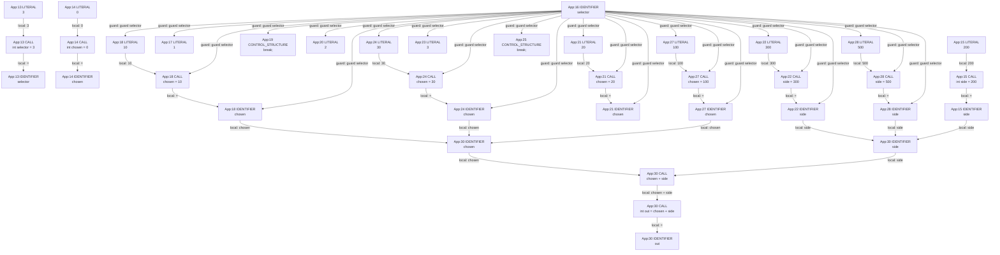

# switchStatement: spike value graph

```mermaid
flowchart TD
  n0["App:13 CALL<br/>int selector = 3"]
  n1["App:13 IDENTIFIER<br/>selector"]
  n2["App:13 LITERAL<br/>3"]
  n3["App:14 CALL<br/>int chosen = 0"]
  n4["App:14 IDENTIFIER<br/>chosen"]
  n5["App:14 LITERAL<br/>0"]
  n6["App:15 CALL<br/>int side = 200"]
  n7["App:15 IDENTIFIER<br/>side"]
  n8["App:15 LITERAL<br/>200"]
  n9["App:16 IDENTIFIER<br/>selector"]
  n10["App:17 LITERAL<br/>1"]
  n11["App:18 CALL<br/>chosen = 10"]
  n12["App:18 IDENTIFIER<br/>chosen"]
  n13["App:18 LITERAL<br/>10"]
  n14["App:19 CONTROL_STRUCTURE<br/>break;"]
  n15["App:20 LITERAL<br/>2"]
  n16["App:21 CALL<br/>chosen = 20"]
  n17["App:21 IDENTIFIER<br/>chosen"]
  n18["App:21 LITERAL<br/>20"]
  n19["App:22 CALL<br/>side = 300"]
  n20["App:22 IDENTIFIER<br/>side"]
  n21["App:22 LITERAL<br/>300"]
  n22["App:23 LITERAL<br/>3"]
  n23["App:24 CALL<br/>chosen = 30"]
  n24["App:24 IDENTIFIER<br/>chosen"]
  n25["App:24 LITERAL<br/>30"]
  n26["App:25 CONTROL_STRUCTURE<br/>break;"]
  n27["App:27 CALL<br/>chosen = 100"]
  n28["App:27 IDENTIFIER<br/>chosen"]
  n29["App:27 LITERAL<br/>100"]
  n30["App:28 CALL<br/>side = 500"]
  n31["App:28 IDENTIFIER<br/>side"]
  n32["App:28 LITERAL<br/>500"]
  n33["App:30 CALL<br/>chosen + side"]
  n34["App:30 CALL<br/>int out = chosen + side"]
  n35["App:30 IDENTIFIER<br/>chosen"]
  n36["App:30 IDENTIFIER<br/>out"]
  n37["App:30 IDENTIFIER<br/>side"]
  n0 -->|"local: ="| n1
  n11 -->|"local: ="| n12
  n12 -->|"local: chosen"| n35
  n13 -->|"local: 10"| n11
  n16 -->|"local: ="| n17
  n18 -->|"local: 20"| n16
  n19 -->|"local: ="| n20
  n2 -->|"local: 3"| n0
  n20 -->|"local: side"| n37
  n21 -->|"local: 300"| n19
  n23 -->|"local: ="| n24
  n24 -->|"local: chosen"| n35
  n25 -->|"local: 30"| n23
  n27 -->|"local: ="| n28
  n28 -->|"local: chosen"| n35
  n29 -->|"local: 100"| n27
  n3 -->|"local: ="| n4
  n30 -->|"local: ="| n31
  n31 -->|"local: side"| n37
  n32 -->|"local: 500"| n30
  n33 -->|"local: chosen + side"| n34
  n34 -->|"local: ="| n36
  n35 -->|"local: chosen"| n33
  n37 -->|"local: side"| n33
  n5 -->|"local: 0"| n3
  n6 -->|"local: ="| n7
  n7 -->|"local: side"| n37
  n8 -->|"local: 200"| n6
  n9 -->|"guard: guard selector"| n10
  n9 -->|"guard: guard selector"| n11
  n9 -->|"guard: guard selector"| n12
  n9 -->|"guard: guard selector"| n13
  n9 -->|"guard: guard selector"| n14
  n9 -->|"guard: guard selector"| n15
  n9 -->|"guard: guard selector"| n16
  n9 -->|"guard: guard selector"| n17
  n9 -->|"guard: guard selector"| n18
  n9 -->|"guard: guard selector"| n19
  n9 -->|"guard: guard selector"| n20
  n9 -->|"guard: guard selector"| n21
  n9 -->|"guard: guard selector"| n22
  n9 -->|"guard: guard selector"| n23
  n9 -->|"guard: guard selector"| n24
  n9 -->|"guard: guard selector"| n25
  n9 -->|"guard: guard selector"| n26
  n9 -->|"guard: guard selector"| n27
  n9 -->|"guard: guard selector"| n28
  n9 -->|"guard: guard selector"| n29
  n9 -->|"guard: guard selector"| n30
  n9 -->|"guard: guard selector"| n31
  n9 -->|"guard: guard selector"| n32
```
