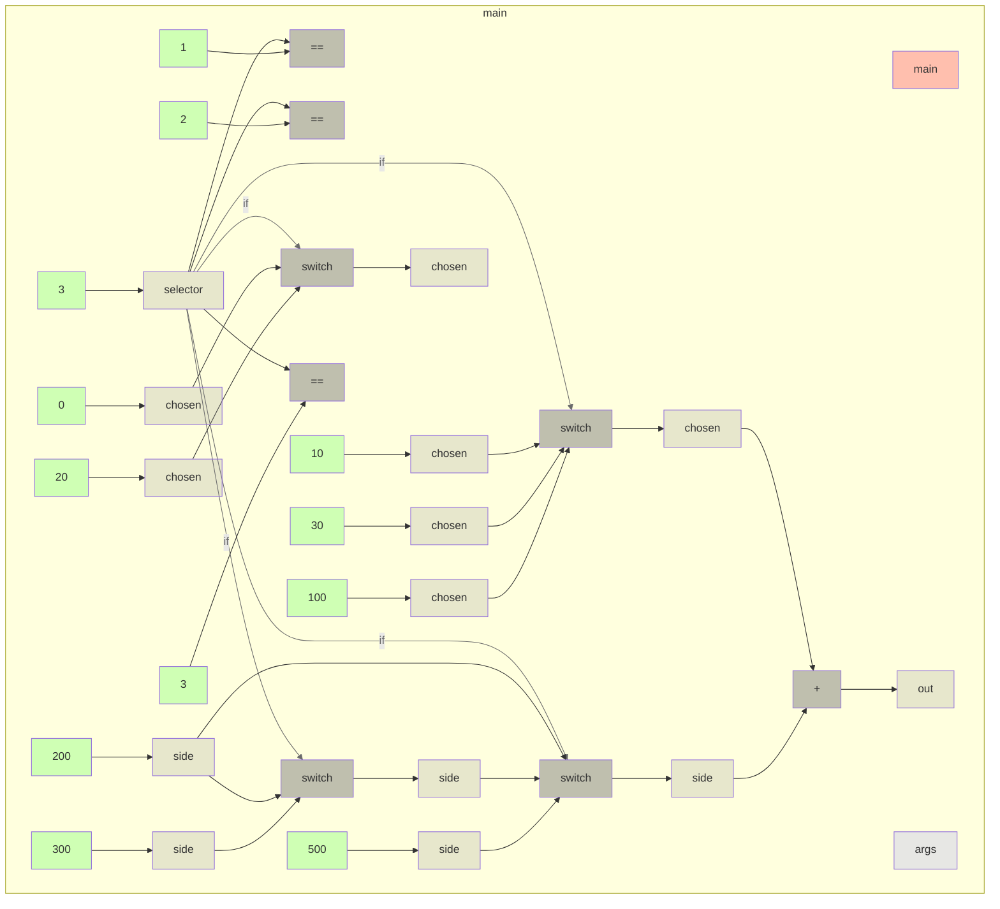

```mermaid
flowchart TD
  subgraph b0["main"]
    n1[main]:::RETURN
    n2[args]:::FUNC_PARAM
    n3[3]:::LITERAL
    n4[selector]:::VARIABLE
    n5[0]:::LITERAL
    n6[chosen]:::VARIABLE
    n7[200]:::LITERAL
    n8[side]:::VARIABLE
    n9[1]:::LITERAL
    n10[==]:::BIN_OP
    n11[10]:::LITERAL
    n12[chosen]:::VARIABLE
    n13[2]:::LITERAL
    n14[==]:::BIN_OP
    n15[20]:::LITERAL
    n16[chosen]:::VARIABLE
    n17[300]:::LITERAL
    n18[side]:::VARIABLE
    n19[switch]:::BIN_OP
    n20[chosen]:::VARIABLE
    n21[switch]:::BIN_OP
    n22[side]:::VARIABLE
    n23[3]:::LITERAL
    n24[==]:::BIN_OP
    n25[30]:::LITERAL
    n26[chosen]:::VARIABLE
    n27[100]:::LITERAL
    n28[chosen]:::VARIABLE
    n29[500]:::LITERAL
    n30[side]:::VARIABLE
    n31[switch]:::BIN_OP
    n32[chosen]:::VARIABLE
    n33[switch]:::BIN_OP
    n34[side]:::VARIABLE
    n35[+]:::BIN_OP
    n36[out]:::VARIABLE
    n3[3]:::LITERAL --> n4[selector]:::VARIABLE
    n4[selector]:::VARIABLE --> n10[==]:::BIN_OP
    n4[selector]:::VARIABLE --> n14[==]:::BIN_OP
    n4[selector]:::VARIABLE -->|if| n19[switch]:::BIN_OP
    n4[selector]:::VARIABLE -->|if| n21[switch]:::BIN_OP
    n4[selector]:::VARIABLE --> n24[==]:::BIN_OP
    n4[selector]:::VARIABLE -->|if| n31[switch]:::BIN_OP
    n4[selector]:::VARIABLE -->|if| n33[switch]:::BIN_OP
    n5[0]:::LITERAL --> n6[chosen]:::VARIABLE
    n6[chosen]:::VARIABLE --> n19[switch]:::BIN_OP
    n7[200]:::LITERAL --> n8[side]:::VARIABLE
    n8[side]:::VARIABLE --> n21[switch]:::BIN_OP
    n8[side]:::VARIABLE --> n33[switch]:::BIN_OP
    n9[1]:::LITERAL --> n10[==]:::BIN_OP
    n11[10]:::LITERAL --> n12[chosen]:::VARIABLE
    n12[chosen]:::VARIABLE --> n31[switch]:::BIN_OP
    n13[2]:::LITERAL --> n14[==]:::BIN_OP
    n15[20]:::LITERAL --> n16[chosen]:::VARIABLE
    n16[chosen]:::VARIABLE --> n19[switch]:::BIN_OP
    n17[300]:::LITERAL --> n18[side]:::VARIABLE
    n18[side]:::VARIABLE --> n21[switch]:::BIN_OP
    n19[switch]:::BIN_OP --> n20[chosen]:::VARIABLE
    n21[switch]:::BIN_OP --> n22[side]:::VARIABLE
    n22[side]:::VARIABLE --> n33[switch]:::BIN_OP
    n23[3]:::LITERAL --> n24[==]:::BIN_OP
    n25[30]:::LITERAL --> n26[chosen]:::VARIABLE
    n26[chosen]:::VARIABLE --> n31[switch]:::BIN_OP
    n27[100]:::LITERAL --> n28[chosen]:::VARIABLE
    n28[chosen]:::VARIABLE --> n31[switch]:::BIN_OP
    n29[500]:::LITERAL --> n30[side]:::VARIABLE
    n30[side]:::VARIABLE --> n33[switch]:::BIN_OP
    n31[switch]:::BIN_OP --> n32[chosen]:::VARIABLE
    n32[chosen]:::VARIABLE --> n35[+]:::BIN_OP
    n33[switch]:::BIN_OP --> n34[side]:::VARIABLE
    n34[side]:::VARIABLE --> n35[+]:::BIN_OP
    n35[+]:::BIN_OP --> n36[out]:::VARIABLE
  end
  linkStyle 3 stroke:#6a6a6a,color:#6a6a6a
  linkStyle 4 stroke:#6a6a6a,color:#6a6a6a
  linkStyle 6 stroke:#6a6a6a,color:#6a6a6a
  linkStyle 7 stroke:#6a6a6a,color:#6a6a6a
  classDef LITERAL fill:#00FF0030
  classDef VARIABLE fill:#80808030
  classDef BIN_OP fill:#80808080
  classDef FUNC_PARAM fill:#8080FF30
  classDef RETURN fill:#FF808080
  classDef EXTERNAL fill:#FFA50040
  classDef UNMODELLED fill:#FF000030,stroke-dasharray: 4 2
```
