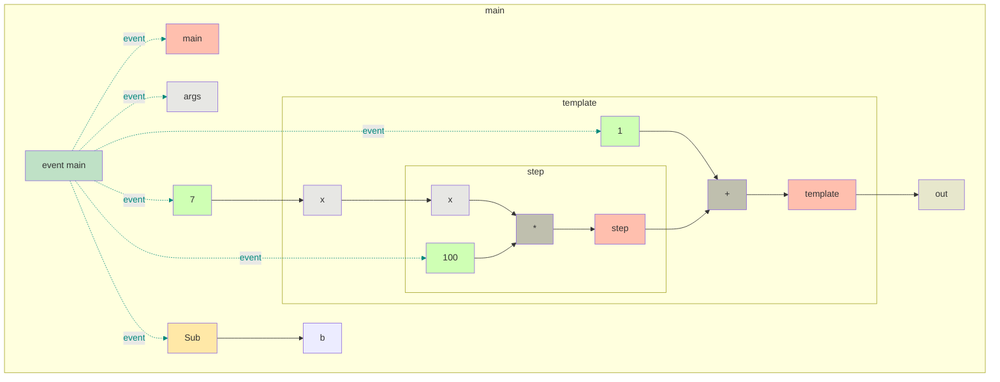

```mermaid
flowchart TD
  subgraph b0["main"]
    n1[event main]:::EVENT
    n2[main]:::RETURN
    n3[args]:::FUNC_PARAM
    n4[Sub]:::EXTERNAL
    n5[b]:::OBJ_VARIABLE
    n6[7]:::LITERAL
    n17[out]:::VARIABLE
    n1[event main]:::EVENT -. event .-> n2[main]:::RETURN
    n1[event main]:::EVENT -. event .-> n3[args]:::FUNC_PARAM
    n1[event main]:::EVENT -. event .-> n4[Sub]:::EXTERNAL
    n1[event main]:::EVENT -. event .-> n6[7]:::LITERAL
    n1[event main]:::EVENT -. event .-> n15[1]:::LITERAL
    n1[event main]:::EVENT -. event .-> n13[100]:::LITERAL
    n4[Sub]:::EXTERNAL --> n5[b]:::OBJ_VARIABLE
    n6[7]:::LITERAL --> n9[x]:::FUNC_PARAM
    n8[template]:::RETURN --> n17[out]:::VARIABLE
    subgraph b7["template"]
      n8[template]:::RETURN
      n9[x]:::FUNC_PARAM
      n15[1]:::LITERAL
      n16[+]:::BIN_OP
      n9[x]:::FUNC_PARAM --> n12[x]:::FUNC_PARAM
      n15[1]:::LITERAL --> n16[+]:::BIN_OP
      n16[+]:::BIN_OP --> n8[template]:::RETURN
      n11[step]:::RETURN --> n16[+]:::BIN_OP
      subgraph b10["step"]
        n11[step]:::RETURN
        n12[x]:::FUNC_PARAM
        n13[100]:::LITERAL
        n14[*]:::BIN_OP
        n12[x]:::FUNC_PARAM --> n14[*]:::BIN_OP
        n13[100]:::LITERAL --> n14[*]:::BIN_OP
        n14[*]:::BIN_OP --> n11[step]:::RETURN
      end
    end
  end
  linkStyle 0 stroke:#00897b,color:#00897b
  linkStyle 1 stroke:#00897b,color:#00897b
  linkStyle 2 stroke:#00897b,color:#00897b
  linkStyle 3 stroke:#00897b,color:#00897b
  linkStyle 4 stroke:#00897b,color:#00897b
  linkStyle 5 stroke:#00897b,color:#00897b
  classDef LITERAL fill:#00FF0030
  classDef VARIABLE fill:#80808030
  classDef BIN_OP fill:#80808080
  classDef FUNC_PARAM fill:#8080FF30
  classDef RETURN fill:#FF808080
  classDef EXTERNAL fill:#FFA50040
  classDef UNMODELLED fill:#FF000030,stroke-dasharray: 4 2
  classDef EVENT fill:#00897B40
```
