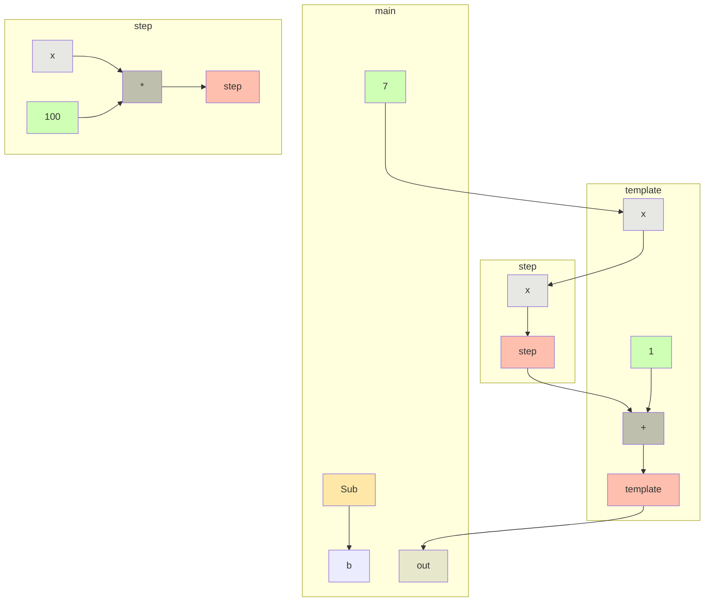

# templateMethod: spike value graph (condensed)

```mermaid
flowchart TD
  subgraph m0["main"]
    n0["Sub"]:::EXTERNAL
    n1["7"]:::LITERAL
    n2["b"]:::OBJ_VARIABLE
    n3["out"]:::VARIABLE
  end
  subgraph m1["step"]
    n4["x"]:::FUNC_PARAM
    n5["step"]:::RETURN
  end
  subgraph m2["template"]
    n6["+"]:::BIN_OP
    n7["x"]:::FUNC_PARAM
    n8["1"]:::LITERAL
    n9["template"]:::RETURN
  end
  subgraph m3["step"]
    n10["*"]:::BIN_OP
    n11["x"]:::FUNC_PARAM
    n12["100"]:::LITERAL
    n13["step"]:::RETURN
  end
  n0 --> n2
  n1 --> n7
  n10 --> n13
  n11 --> n10
  n12 --> n10
  n4 --> n5
  n5 --> n6
  n6 --> n9
  n7 --> n4
  n8 --> n6
  n9 --> n3
  classDef LITERAL fill:#00FF0030
  classDef VARIABLE fill:#80808030
  classDef BIN_OP fill:#80808080
  classDef FUNC_PARAM fill:#8080FF30
  classDef RETURN fill:#FF808080
  classDef EXTERNAL fill:#FFA50040
  classDef UNMODELLED fill:#FF000030,stroke-dasharray: 4 2
```
