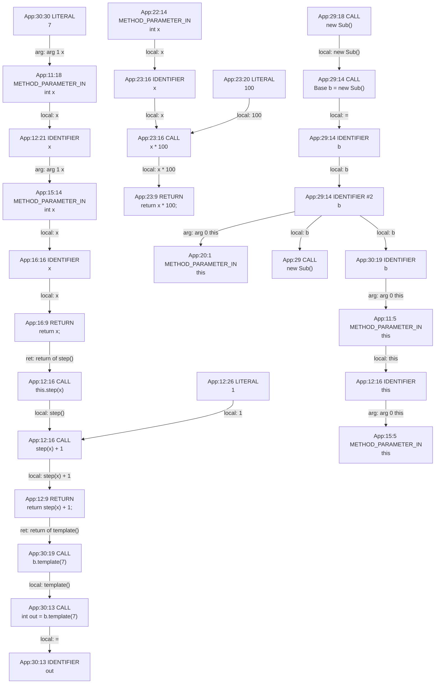

# templateMethod: spike value graph

```mermaid
flowchart TD
  n0["App:11:18 METHOD_PARAMETER_IN<br/>int x"]
  n1["App:11:5 METHOD_PARAMETER_IN<br/>this"]
  n2["App:12:16 CALL<br/>step(x) + 1"]
  n3["App:12:16 CALL<br/>this.step(x)"]
  n4["App:12:16 IDENTIFIER<br/>this"]
  n5["App:12:21 IDENTIFIER<br/>x"]
  n6["App:12:26 LITERAL<br/>1"]
  n7["App:12:9 RETURN<br/>return step(x) + 1;"]
  n8["App:15:14 METHOD_PARAMETER_IN<br/>int x"]
  n9["App:15:5 METHOD_PARAMETER_IN<br/>this"]
  n10["App:16:16 IDENTIFIER<br/>x"]
  n11["App:16:9 RETURN<br/>return x;"]
  n12["App:20:1 METHOD_PARAMETER_IN<br/>this"]
  n13["App:22:14 METHOD_PARAMETER_IN<br/>int x"]
  n14["App:23:16 CALL<br/>x * 100"]
  n15["App:23:16 IDENTIFIER<br/>x"]
  n16["App:23:20 LITERAL<br/>100"]
  n17["App:23:9 RETURN<br/>return x * 100;"]
  n18["App:29 CALL<br/>new Sub()"]
  n19["App:29:14 CALL<br/>Base b = new Sub()"]
  n20["App:29:14 IDENTIFIER #2<br/>b"]
  n21["App:29:14 IDENTIFIER<br/>b"]
  n22["App:29:18 CALL<br/>new Sub()"]
  n23["App:30:13 CALL<br/>int out = b.template(7)"]
  n24["App:30:13 IDENTIFIER<br/>out"]
  n25["App:30:19 CALL<br/>b.template(7)"]
  n26["App:30:19 IDENTIFIER<br/>b"]
  n27["App:30:30 LITERAL<br/>7"]
  n0 -->|"local: x"| n5
  n1 -->|"local: this"| n4
  n10 -->|"local: x"| n11
  n11 -->|"ret: return of step()"| n3
  n13 -->|"local: x"| n15
  n14 -->|"local: x * 100"| n17
  n15 -->|"local: x"| n14
  n16 -->|"local: 100"| n14
  n19 -->|"local: ="| n21
  n2 -->|"local: step(x) + 1"| n7
  n20 -->|"arg: arg 0 this"| n12
  n20 -->|"local: b"| n18
  n20 -->|"local: b"| n26
  n21 -->|"local: b"| n20
  n22 -->|"local: new Sub()"| n19
  n23 -->|"local: ="| n24
  n25 -->|"local: template()"| n23
  n26 -->|"arg: arg 0 this"| n1
  n27 -->|"arg: arg 1 x"| n0
  n3 -->|"local: step()"| n2
  n4 -->|"arg: arg 0 this"| n9
  n5 -->|"arg: arg 1 x"| n8
  n6 -->|"local: 1"| n2
  n7 -->|"ret: return of template()"| n25
  n8 -->|"local: x"| n10
```
