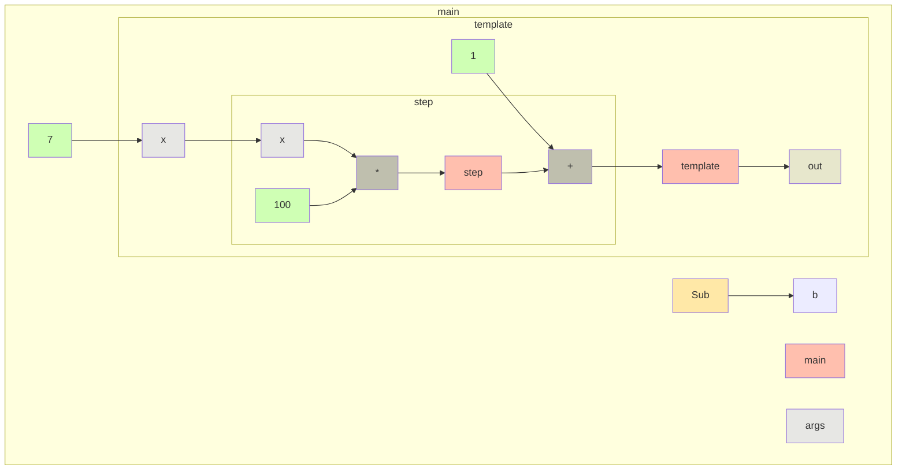

```mermaid
flowchart TD
  subgraph b0["main"]
    n1[main]:::RETURN
    n2[args]:::FUNC_PARAM
    n3[Sub]:::EXTERNAL
    n4[b]:::OBJ_VARIABLE
    n5[7]:::LITERAL
    n16[out]:::VARIABLE
    n3[Sub]:::EXTERNAL --> n4[b]:::OBJ_VARIABLE
    n5[7]:::LITERAL --> n8[x]:::FUNC_PARAM
    subgraph b6["template"]
      n7[template]:::RETURN
      n8[x]:::FUNC_PARAM
      n14[1]:::LITERAL
      n15[+]:::BIN_OP
      n7[template]:::RETURN --> n16[out]:::VARIABLE
      n8[x]:::FUNC_PARAM --> n11[x]:::FUNC_PARAM
      n14[1]:::LITERAL --> n15[+]:::BIN_OP
      n15[+]:::BIN_OP --> n7[template]:::RETURN
      subgraph b9["step"]
        n10[step]:::RETURN
        n11[x]:::FUNC_PARAM
        n12[100]:::LITERAL
        n13[*]:::BIN_OP
        n10[step]:::RETURN --> n15[+]:::BIN_OP
        n11[x]:::FUNC_PARAM --> n13[*]:::BIN_OP
        n12[100]:::LITERAL --> n13[*]:::BIN_OP
        n13[*]:::BIN_OP --> n10[step]:::RETURN
      end
    end
  end
  classDef LITERAL fill:#00FF0030
  classDef VARIABLE fill:#80808030
  classDef BIN_OP fill:#80808080
  classDef FUNC_PARAM fill:#8080FF30
  classDef RETURN fill:#FF808080
  classDef EXTERNAL fill:#FFA50040
  classDef UNMODELLED fill:#FF000030,stroke-dasharray: 4 2
```
