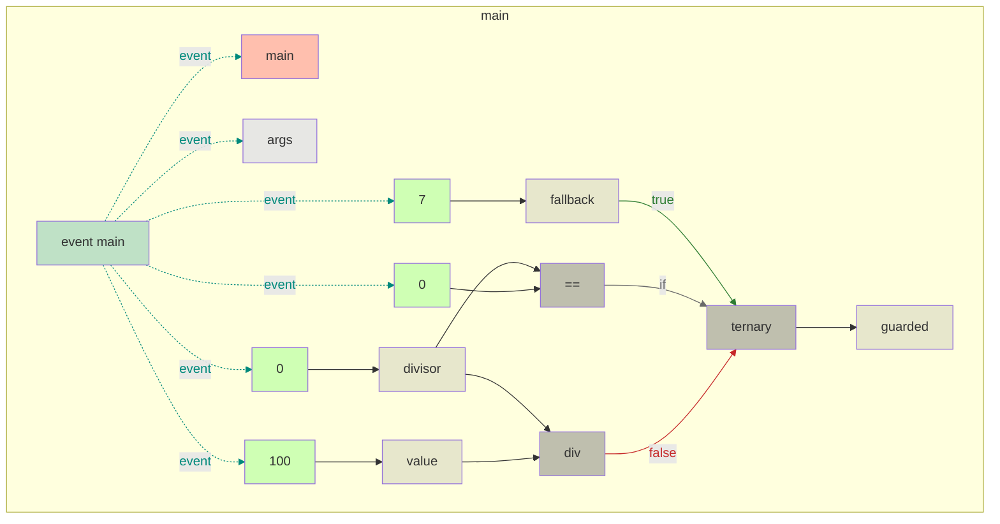

```mermaid
flowchart TD
  subgraph b0["main"]
    n1[event main]:::EVENT
    n2[main]:::RETURN
    n3[args]:::FUNC_PARAM
    n4[0]:::LITERAL
    n5[divisor]:::VARIABLE
    n6[100]:::LITERAL
    n7[value]:::VARIABLE
    n8[7]:::LITERAL
    n9[fallback]:::VARIABLE
    n10[0]:::LITERAL
    n11[==]:::BIN_OP
    n12[div]:::BIN_OP
    n13[ternary]:::BIN_OP
    n14[guarded]:::VARIABLE
    n1[event main]:::EVENT -. event .-> n2[main]:::RETURN
    n1[event main]:::EVENT -. event .-> n3[args]:::FUNC_PARAM
    n1[event main]:::EVENT -. event .-> n4[0]:::LITERAL
    n1[event main]:::EVENT -. event .-> n6[100]:::LITERAL
    n1[event main]:::EVENT -. event .-> n8[7]:::LITERAL
    n1[event main]:::EVENT -. event .-> n10[0]:::LITERAL
    n4[0]:::LITERAL --> n5[divisor]:::VARIABLE
    n5[divisor]:::VARIABLE --> n11[==]:::BIN_OP
    n5[divisor]:::VARIABLE --> n12[div]:::BIN_OP
    n6[100]:::LITERAL --> n7[value]:::VARIABLE
    n7[value]:::VARIABLE --> n12[div]:::BIN_OP
    n8[7]:::LITERAL --> n9[fallback]:::VARIABLE
    n9[fallback]:::VARIABLE -->|true| n13[ternary]:::BIN_OP
    n10[0]:::LITERAL --> n11[==]:::BIN_OP
    n11[==]:::BIN_OP -->|if| n13[ternary]:::BIN_OP
    n12[div]:::BIN_OP -->|false| n13[ternary]:::BIN_OP
    n13[ternary]:::BIN_OP --> n14[guarded]:::VARIABLE
  end
  linkStyle 0 stroke:#00897b,color:#00897b
  linkStyle 1 stroke:#00897b,color:#00897b
  linkStyle 2 stroke:#00897b,color:#00897b
  linkStyle 3 stroke:#00897b,color:#00897b
  linkStyle 4 stroke:#00897b,color:#00897b
  linkStyle 5 stroke:#00897b,color:#00897b
  linkStyle 12 stroke:#2e7d32,color:#2e7d32
  linkStyle 14 stroke:#6a6a6a,color:#6a6a6a
  linkStyle 15 stroke:#c62828,color:#c62828
  classDef LITERAL fill:#00FF0030
  classDef VARIABLE fill:#80808030
  classDef BIN_OP fill:#80808080
  classDef FUNC_PARAM fill:#8080FF30
  classDef RETURN fill:#FF808080
  classDef EXTERNAL fill:#FFA50040
  classDef UNMODELLED fill:#FF000030,stroke-dasharray: 4 2
  classDef EVENT fill:#00897B40
```
