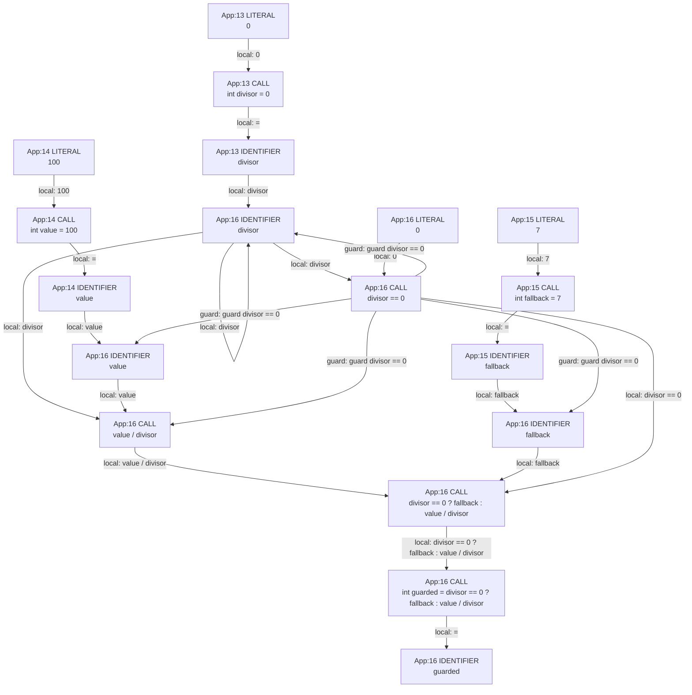

# ternary: spike value graph

```mermaid
flowchart TD
  n0["App:13 CALL<br/>int divisor = 0"]
  n1["App:13 IDENTIFIER<br/>divisor"]
  n2["App:13 LITERAL<br/>0"]
  n3["App:14 CALL<br/>int value = 100"]
  n4["App:14 IDENTIFIER<br/>value"]
  n5["App:14 LITERAL<br/>100"]
  n6["App:15 CALL<br/>int fallback = 7"]
  n7["App:15 IDENTIFIER<br/>fallback"]
  n8["App:15 LITERAL<br/>7"]
  n9["App:16 CALL<br/>divisor == 0"]
  n10["App:16 CALL<br/>divisor == 0 ? fallback : value / divisor"]
  n11["App:16 CALL<br/>int guarded = divisor == 0 ? fallback : value / divisor"]
  n12["App:16 CALL<br/>value / divisor"]
  n13["App:16 IDENTIFIER<br/>divisor"]
  n14["App:16 IDENTIFIER<br/>fallback"]
  n15["App:16 IDENTIFIER<br/>guarded"]
  n16["App:16 IDENTIFIER<br/>value"]
  n17["App:16 LITERAL<br/>0"]
  n0 -->|"local: ="| n1
  n1 -->|"local: divisor"| n13
  n10 -->|"local: divisor == 0 ? fallback : value / divisor"| n11
  n11 -->|"local: ="| n15
  n12 -->|"local: value / divisor"| n10
  n13 -->|"local: divisor"| n12
  n13 -->|"local: divisor"| n13
  n13 -->|"local: divisor"| n9
  n14 -->|"local: fallback"| n10
  n16 -->|"local: value"| n12
  n17 -->|"local: 0"| n9
  n2 -->|"local: 0"| n0
  n3 -->|"local: ="| n4
  n4 -->|"local: value"| n16
  n5 -->|"local: 100"| n3
  n6 -->|"local: ="| n7
  n7 -->|"local: fallback"| n14
  n8 -->|"local: 7"| n6
  n9 -->|"guard: guard divisor == 0"| n12
  n9 -->|"guard: guard divisor == 0"| n13
  n9 -->|"guard: guard divisor == 0"| n14
  n9 -->|"guard: guard divisor == 0"| n16
  n9 -->|"local: divisor == 0"| n10
```
