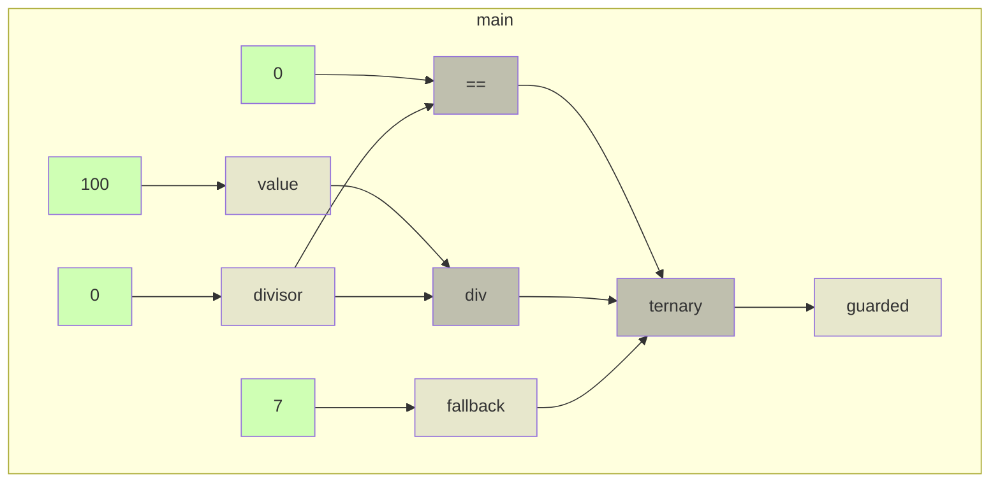

# ternary: spike value graph (condensed)

```mermaid
flowchart TD
  subgraph m0["main"]
    n0["=="]:::BIN_OP
    n1["div"]:::BIN_OP
    n2["ternary"]:::BIN_OP
    n3["0"]:::LITERAL
    n4["0"]:::LITERAL
    n5["100"]:::LITERAL
    n6["7"]:::LITERAL
    n7["divisor"]:::VARIABLE
    n8["fallback"]:::VARIABLE
    n9["guarded"]:::VARIABLE
    n10["value"]:::VARIABLE
  end
  n0 --> n2
  n1 --> n2
  n10 --> n1
  n2 --> n9
  n3 --> n7
  n4 --> n0
  n5 --> n10
  n6 --> n8
  n7 --> n0
  n7 --> n1
  n8 --> n2
  classDef LITERAL fill:#00FF0030
  classDef VARIABLE fill:#80808030
  classDef BIN_OP fill:#80808080
  classDef FUNC_PARAM fill:#8080FF30
  classDef RETURN fill:#FF808080
  classDef EXTERNAL fill:#FFA50040
  classDef UNMODELLED fill:#FF000030,stroke-dasharray: 4 2
```
