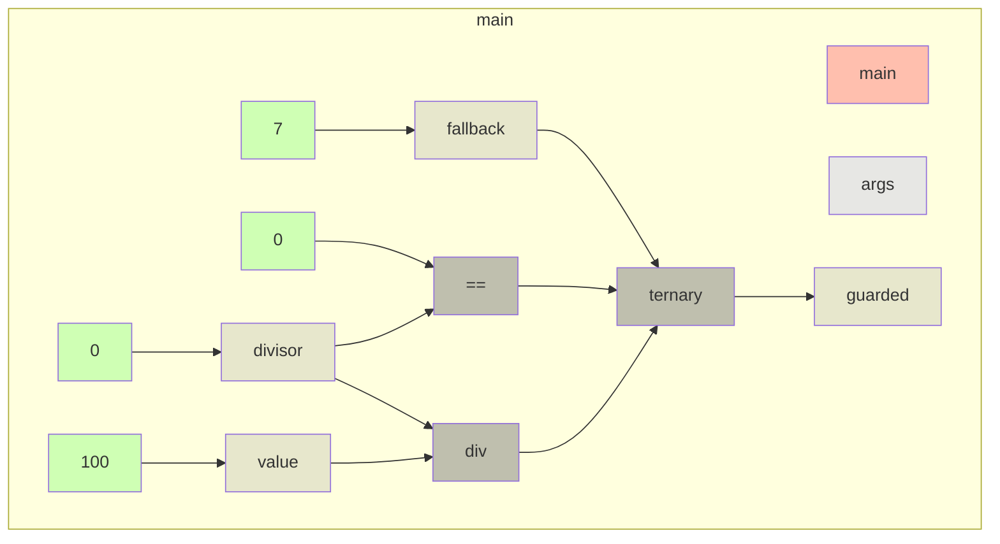

```mermaid
flowchart TD
  subgraph 4309014["main"]
    -22338069009[ternary]:::BIN_OP
    56853577[main]:::RETURN
    1861666579[0]:::LITERAL
    1861726317[7]:::LITERAL
    1862384632[0]:::LITERAL
    1862413992[==]:::BIN_OP
    1862521311[100]:::LITERAL
    1864099816[div]:::BIN_OP
    1912617894[args]:::FUNC_PARAM
    3765225955[value]:::VARIABLE
    8089242853[guarded]:::VARIABLE
    14802835783[fallback]:::VARIABLE
    30325326750[divisor]:::VARIABLE
    -22338069009[ternary]:::BIN_OP --> 8089242853[guarded]:::VARIABLE
    1861666579[0]:::LITERAL --> 30325326750[divisor]:::VARIABLE
    1861726317[7]:::LITERAL --> 14802835783[fallback]:::VARIABLE
    1862384632[0]:::LITERAL --> 1862413992[==]:::BIN_OP
    1862413992[==]:::BIN_OP --> -22338069009[ternary]:::BIN_OP
    1862521311[100]:::LITERAL --> 3765225955[value]:::VARIABLE
    1864099816[div]:::BIN_OP --> -22338069009[ternary]:::BIN_OP
    3765225955[value]:::VARIABLE --> 1864099816[div]:::BIN_OP
    14802835783[fallback]:::VARIABLE --> -22338069009[ternary]:::BIN_OP
    30325326750[divisor]:::VARIABLE --> 1862413992[==]:::BIN_OP
    30325326750[divisor]:::VARIABLE --> 1864099816[div]:::BIN_OP
  end
  classDef LITERAL fill:#00FF0030
  classDef VARIABLE fill:#80808030
  classDef BIN_OP fill:#80808080
  classDef FUNC_PARAM fill:#8080FF30
  classDef RETURN fill:#FF808080
```
