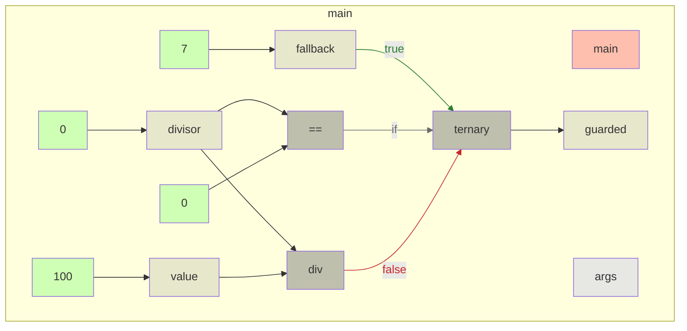

```mermaid
flowchart TD
  subgraph b0["main"]
    n1[main]:::RETURN
    n2[args]:::FUNC_PARAM
    n3[0]:::LITERAL
    n4[divisor]:::VARIABLE
    n5[100]:::LITERAL
    n6[value]:::VARIABLE
    n7[7]:::LITERAL
    n8[fallback]:::VARIABLE
    n9[0]:::LITERAL
    n10[==]:::BIN_OP
    n11[div]:::BIN_OP
    n12[ternary]:::BIN_OP
    n13[guarded]:::VARIABLE
    n3[0]:::LITERAL --> n4[divisor]:::VARIABLE
    n4[divisor]:::VARIABLE --> n10[==]:::BIN_OP
    n4[divisor]:::VARIABLE --> n11[div]:::BIN_OP
    n5[100]:::LITERAL --> n6[value]:::VARIABLE
    n6[value]:::VARIABLE --> n11[div]:::BIN_OP
    n7[7]:::LITERAL --> n8[fallback]:::VARIABLE
    n8[fallback]:::VARIABLE -->|true| n12[ternary]:::BIN_OP
    n9[0]:::LITERAL --> n10[==]:::BIN_OP
    n10[==]:::BIN_OP -->|if| n12[ternary]:::BIN_OP
    n11[div]:::BIN_OP -->|false| n12[ternary]:::BIN_OP
    n12[ternary]:::BIN_OP --> n13[guarded]:::VARIABLE
  end
  linkStyle 6 stroke:#2e7d32,color:#2e7d32
  linkStyle 8 stroke:#6a6a6a,color:#6a6a6a
  linkStyle 9 stroke:#c62828,color:#c62828
  classDef LITERAL fill:#00FF0030
  classDef VARIABLE fill:#80808030
  classDef BIN_OP fill:#80808080
  classDef FUNC_PARAM fill:#8080FF30
  classDef RETURN fill:#FF808080
  classDef EXTERNAL fill:#FFA50040
  classDef UNMODELLED fill:#FF000030,stroke-dasharray: 4 2
```
