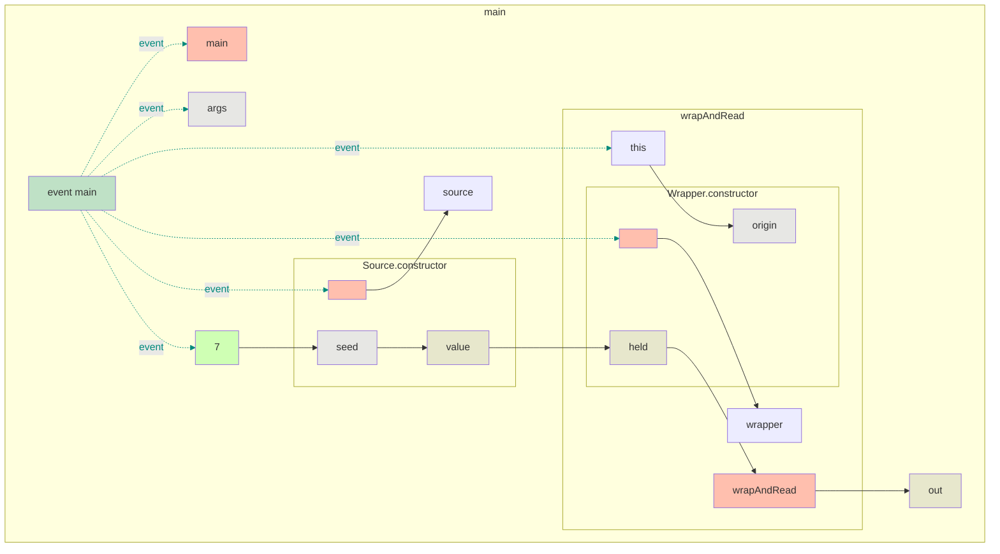

```mermaid
flowchart TD
  subgraph b0["main"]
    n1[event main]:::EVENT
    n2[main]:::RETURN
    n3[args]:::FUNC_PARAM
    n4[7]:::LITERAL
    n9[source]:::OBJ_VARIABLE
    n18[out]:::VARIABLE
    n1[event main]:::EVENT -. event .-> n2[main]:::RETURN
    n1[event main]:::EVENT -. event .-> n3[args]:::FUNC_PARAM
    n1[event main]:::EVENT -. event .-> n4[7]:::LITERAL
    n1[event main]:::EVENT -. event .-> n6[<init>]:::RETURN
    n1[event main]:::EVENT -. event .-> n12[this]:::OBJ_VARIABLE
    n1[event main]:::EVENT -. event .-> n14[<init>]:::RETURN
    n4[7]:::LITERAL --> n7[seed]:::FUNC_PARAM
    n6[<init>]:::RETURN --> n9[source]:::OBJ_VARIABLE
    n8[value]:::VARIABLE --> n16[held]:::VARIABLE
    n11[wrapAndRead]:::RETURN --> n18[out]:::VARIABLE
    subgraph b5["Source.constructor"]
      n6[<init>]:::RETURN
      n7[seed]:::FUNC_PARAM
      n8[value]:::VARIABLE
      n7[seed]:::FUNC_PARAM --> n8[value]:::VARIABLE
    end
    subgraph b10["wrapAndRead"]
      n11[wrapAndRead]:::RETURN
      n12[this]:::OBJ_VARIABLE
      n17[wrapper]:::OBJ_VARIABLE
      n12[this]:::OBJ_VARIABLE --> n15[origin]:::FUNC_PARAM
      n14[<init>]:::RETURN --> n17[wrapper]:::OBJ_VARIABLE
      n16[held]:::VARIABLE --> n11[wrapAndRead]:::RETURN
      subgraph b13["Wrapper.constructor"]
        n14[<init>]:::RETURN
        n15[origin]:::FUNC_PARAM
        n16[held]:::VARIABLE
      end
    end
  end
  linkStyle 0 stroke:#00897b,color:#00897b
  linkStyle 1 stroke:#00897b,color:#00897b
  linkStyle 2 stroke:#00897b,color:#00897b
  linkStyle 3 stroke:#00897b,color:#00897b
  linkStyle 4 stroke:#00897b,color:#00897b
  linkStyle 5 stroke:#00897b,color:#00897b
  classDef LITERAL fill:#00FF0030
  classDef VARIABLE fill:#80808030
  classDef BIN_OP fill:#80808080
  classDef FUNC_PARAM fill:#8080FF30
  classDef RETURN fill:#FF808080
  classDef EXTERNAL fill:#FFA50040
  classDef UNMODELLED fill:#FF000030,stroke-dasharray: 4 2
  classDef EVENT fill:#00897B40
```
