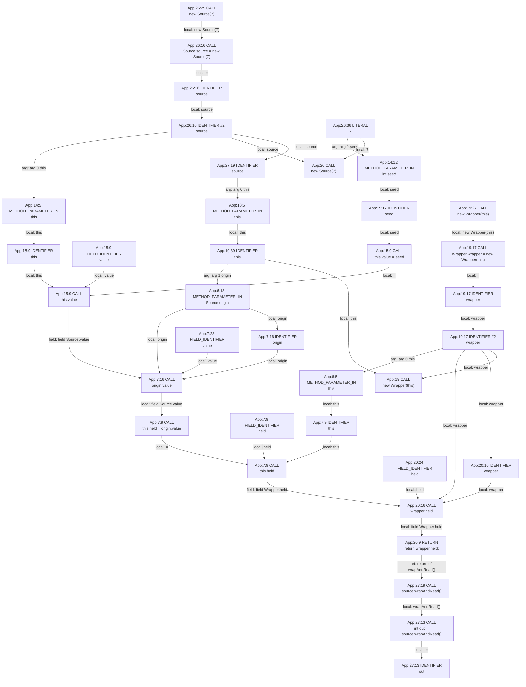

# thisReference: spike value graph

```mermaid
flowchart TD
  n0["App:14:12 METHOD_PARAMETER_IN<br/>int seed"]
  n1["App:14:5 METHOD_PARAMETER_IN<br/>this"]
  n2["App:15:17 IDENTIFIER<br/>seed"]
  n3["App:15:9 CALL<br/>this.value"]
  n4["App:15:9 CALL<br/>this.value = seed"]
  n5["App:15:9 FIELD_IDENTIFIER<br/>value"]
  n6["App:15:9 IDENTIFIER<br/>this"]
  n7["App:18:5 METHOD_PARAMETER_IN<br/>this"]
  n8["App:19 CALL<br/>new Wrapper(this)"]
  n9["App:19:17 CALL<br/>Wrapper wrapper = new Wrapper(this)"]
  n10["App:19:17 IDENTIFIER #2<br/>wrapper"]
  n11["App:19:17 IDENTIFIER<br/>wrapper"]
  n12["App:19:27 CALL<br/>new Wrapper(this)"]
  n13["App:19:39 IDENTIFIER<br/>this"]
  n14["App:20:16 CALL<br/>wrapper.held"]
  n15["App:20:16 IDENTIFIER<br/>wrapper"]
  n16["App:20:24 FIELD_IDENTIFIER<br/>held"]
  n17["App:20:9 RETURN<br/>return wrapper.held;"]
  n18["App:26 CALL<br/>new Source(7)"]
  n19["App:26:16 CALL<br/>Source source = new Source(7)"]
  n20["App:26:16 IDENTIFIER #2<br/>source"]
  n21["App:26:16 IDENTIFIER<br/>source"]
  n22["App:26:25 CALL<br/>new Source(7)"]
  n23["App:26:36 LITERAL<br/>7"]
  n24["App:27:13 CALL<br/>int out = source.wrapAndRead()"]
  n25["App:27:13 IDENTIFIER<br/>out"]
  n26["App:27:19 CALL<br/>source.wrapAndRead()"]
  n27["App:27:19 IDENTIFIER<br/>source"]
  n28["App:6:13 METHOD_PARAMETER_IN<br/>Source origin"]
  n29["App:6:5 METHOD_PARAMETER_IN<br/>this"]
  n30["App:7:16 CALL<br/>origin.value"]
  n31["App:7:16 IDENTIFIER<br/>origin"]
  n32["App:7:23 FIELD_IDENTIFIER<br/>value"]
  n33["App:7:9 CALL<br/>this.held"]
  n34["App:7:9 CALL<br/>this.held = origin.value"]
  n35["App:7:9 FIELD_IDENTIFIER<br/>held"]
  n36["App:7:9 IDENTIFIER<br/>this"]
  n0 -->|"local: seed"| n2
  n1 -->|"local: this"| n6
  n10 -->|"arg: arg 0 this"| n29
  n10 -->|"local: wrapper"| n14
  n10 -->|"local: wrapper"| n15
  n10 -->|"local: wrapper"| n8
  n11 -->|"local: wrapper"| n10
  n12 -->|"local: new Wrapper(this)"| n9
  n13 -->|"arg: arg 1 origin"| n28
  n13 -->|"local: this"| n8
  n14 -->|"local: field Wrapper.held"| n17
  n15 -->|"local: wrapper"| n14
  n16 -->|"local: held"| n14
  n17 -->|"ret: return of wrapAndRead()"| n26
  n19 -->|"local: ="| n21
  n2 -->|"local: seed"| n4
  n20 -->|"arg: arg 0 this"| n1
  n20 -->|"local: source"| n18
  n20 -->|"local: source"| n27
  n21 -->|"local: source"| n20
  n22 -->|"local: new Source(7)"| n19
  n23 -->|"arg: arg 1 seed"| n0
  n23 -->|"local: 7"| n18
  n24 -->|"local: ="| n25
  n26 -->|"local: wrapAndRead()"| n24
  n27 -->|"arg: arg 0 this"| n7
  n28 -->|"local: origin"| n30
  n28 -->|"local: origin"| n31
  n29 -->|"local: this"| n36
  n3 -->|"field: field Source.value"| n30
  n30 -->|"local: field Source.value"| n34
  n31 -->|"local: origin"| n30
  n32 -->|"local: value"| n30
  n33 -->|"field: field Wrapper.held"| n14
  n34 -->|"local: ="| n33
  n35 -->|"local: held"| n33
  n36 -->|"local: this"| n33
  n4 -->|"local: ="| n3
  n5 -->|"local: value"| n3
  n6 -->|"local: this"| n3
  n7 -->|"local: this"| n13
  n9 -->|"local: ="| n11
```
