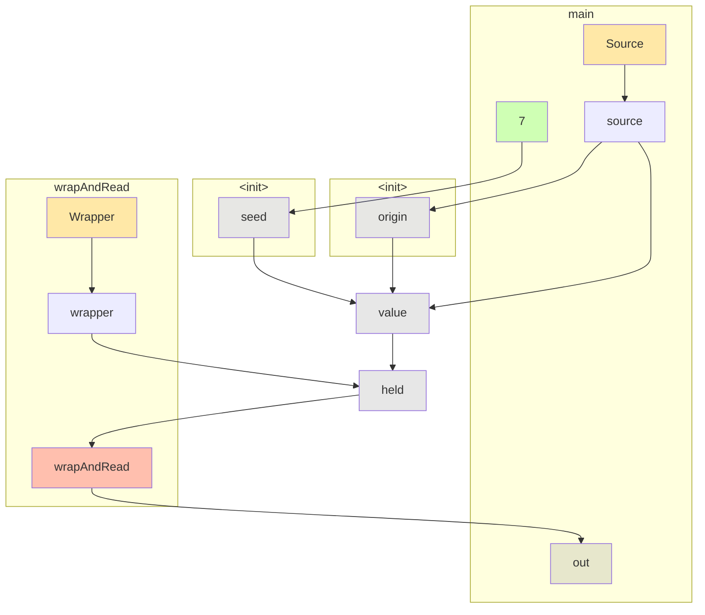

# thisReference: spike value graph (condensed)

```mermaid
flowchart TD
  subgraph m0["main"]
    n0["Source"]:::EXTERNAL
    n1["7"]:::LITERAL
    n2["source"]:::OBJ_VARIABLE
    n3["out"]:::VARIABLE
  end
  subgraph m1["#lt;init#gt;"]
    n4["seed"]:::FUNC_PARAM
  end
  subgraph m2["wrapAndRead"]
    n5["Wrapper"]:::EXTERNAL
    n6["wrapper"]:::OBJ_VARIABLE
    n7["wrapAndRead"]:::RETURN
  end
  subgraph m3["#lt;init#gt;"]
    n8["origin"]:::FUNC_PARAM
  end
  n9["value"]:::VARIABLE
  n10["held"]:::VARIABLE
  n0 --> n2
  n1 --> n4
  n10 --> n7
  n2 --> n8
  n2 --> n9
  n4 --> n9
  n5 --> n6
  n6 --> n10
  n7 --> n3
  n8 --> n9
  n9 --> n10
  classDef LITERAL fill:#00FF0030
  classDef VARIABLE fill:#80808030
  classDef BIN_OP fill:#80808080
  classDef FUNC_PARAM fill:#8080FF30
  classDef RETURN fill:#FF808080
  classDef EXTERNAL fill:#FFA50040
  classDef UNMODELLED fill:#FF000030,stroke-dasharray: 4 2
```
