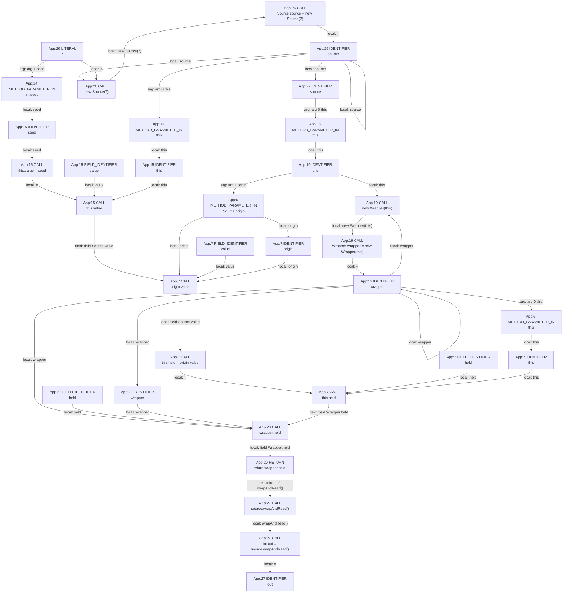

# thisReference: spike value graph

```mermaid
flowchart TD
  n0["App:14 METHOD_PARAMETER_IN<br/>int seed"]
  n1["App:14 METHOD_PARAMETER_IN<br/>this"]
  n2["App:15 CALL<br/>this.value"]
  n3["App:15 CALL<br/>this.value = seed"]
  n4["App:15 FIELD_IDENTIFIER<br/>value"]
  n5["App:15 IDENTIFIER<br/>seed"]
  n6["App:15 IDENTIFIER<br/>this"]
  n7["App:18 METHOD_PARAMETER_IN<br/>this"]
  n8["App:19 CALL<br/>Wrapper wrapper = new Wrapper(this)"]
  n9["App:19 CALL<br/>new Wrapper(this)"]
  n10["App:19 IDENTIFIER<br/>this"]
  n11["App:19 IDENTIFIER<br/>wrapper"]
  n12["App:20 CALL<br/>wrapper.held"]
  n13["App:20 FIELD_IDENTIFIER<br/>held"]
  n14["App:20 IDENTIFIER<br/>wrapper"]
  n15["App:20 RETURN<br/>return wrapper.held;"]
  n16["App:26 CALL<br/>Source source = new Source(7)"]
  n17["App:26 CALL<br/>new Source(7)"]
  n18["App:26 IDENTIFIER<br/>source"]
  n19["App:26 LITERAL<br/>7"]
  n20["App:27 CALL<br/>int out = source.wrapAndRead()"]
  n21["App:27 CALL<br/>source.wrapAndRead()"]
  n22["App:27 IDENTIFIER<br/>out"]
  n23["App:27 IDENTIFIER<br/>source"]
  n24["App:6 METHOD_PARAMETER_IN<br/>Source origin"]
  n25["App:6 METHOD_PARAMETER_IN<br/>this"]
  n26["App:7 CALL<br/>origin.value"]
  n27["App:7 CALL<br/>this.held"]
  n28["App:7 CALL<br/>this.held = origin.value"]
  n29["App:7 FIELD_IDENTIFIER<br/>held"]
  n30["App:7 FIELD_IDENTIFIER<br/>value"]
  n31["App:7 IDENTIFIER<br/>origin"]
  n32["App:7 IDENTIFIER<br/>this"]
  n0 -->|"local: seed"| n5
  n1 -->|"local: this"| n6
  n10 -->|"arg: arg 1 origin"| n24
  n10 -->|"local: this"| n9
  n11 -->|"arg: arg 0 this"| n25
  n11 -->|"local: wrapper"| n11
  n11 -->|"local: wrapper"| n12
  n11 -->|"local: wrapper"| n14
  n11 -->|"local: wrapper"| n9
  n12 -->|"local: field Wrapper.held"| n15
  n13 -->|"local: held"| n12
  n14 -->|"local: wrapper"| n12
  n15 -->|"ret: return of wrapAndRead()"| n21
  n16 -->|"local: ="| n18
  n17 -->|"local: new Source(7)"| n16
  n18 -->|"arg: arg 0 this"| n1
  n18 -->|"local: source"| n17
  n18 -->|"local: source"| n18
  n18 -->|"local: source"| n23
  n19 -->|"arg: arg 1 seed"| n0
  n19 -->|"local: 7"| n17
  n2 -->|"field: field Source.value"| n26
  n20 -->|"local: ="| n22
  n21 -->|"local: wrapAndRead()"| n20
  n23 -->|"arg: arg 0 this"| n7
  n24 -->|"local: origin"| n26
  n24 -->|"local: origin"| n31
  n25 -->|"local: this"| n32
  n26 -->|"local: field Source.value"| n28
  n27 -->|"field: field Wrapper.held"| n12
  n28 -->|"local: ="| n27
  n29 -->|"local: held"| n27
  n3 -->|"local: ="| n2
  n30 -->|"local: value"| n26
  n31 -->|"local: origin"| n26
  n32 -->|"local: this"| n27
  n4 -->|"local: value"| n2
  n5 -->|"local: seed"| n3
  n6 -->|"local: this"| n2
  n7 -->|"local: this"| n10
  n8 -->|"local: ="| n11
  n9 -->|"local: new Wrapper(this)"| n8
```
