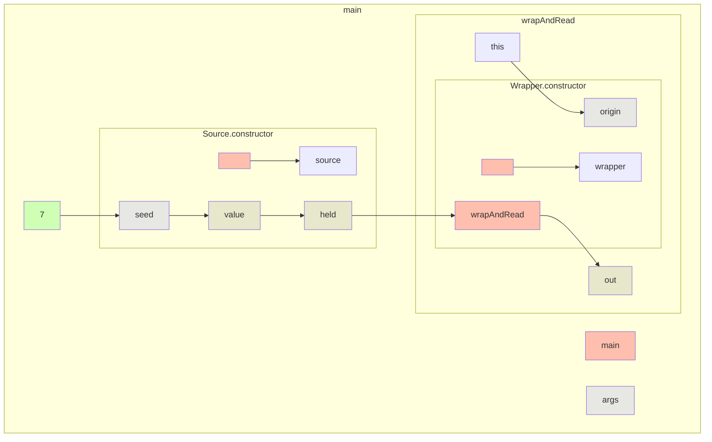

```mermaid
flowchart TD
  subgraph b0["main"]
    n1[main]:::RETURN
    n2[args]:::FUNC_PARAM
    n3[7]:::LITERAL
    n8[source]:::OBJ_VARIABLE
    n17[out]:::VARIABLE
    n3[7]:::LITERAL --> n6[seed]:::FUNC_PARAM
    subgraph b4["Source.constructor"]
      n5[<init>]:::RETURN
      n6[seed]:::FUNC_PARAM
      n7[value]:::VARIABLE
      n5[<init>]:::RETURN --> n8[source]:::OBJ_VARIABLE
      n6[seed]:::FUNC_PARAM --> n7[value]:::VARIABLE
      n7[value]:::VARIABLE --> n15[held]:::VARIABLE
    end
    subgraph b9["wrapAndRead"]
      n10[wrapAndRead]:::RETURN
      n11[this]:::OBJ_VARIABLE
      n16[wrapper]:::OBJ_VARIABLE
      n10[wrapAndRead]:::RETURN --> n17[out]:::VARIABLE
      n11[this]:::OBJ_VARIABLE --> n14[origin]:::FUNC_PARAM
      subgraph b12["Wrapper.constructor"]
        n13[<init>]:::RETURN
        n14[origin]:::FUNC_PARAM
        n15[held]:::VARIABLE
        n13[<init>]:::RETURN --> n16[wrapper]:::OBJ_VARIABLE
        n15[held]:::VARIABLE --> n10[wrapAndRead]:::RETURN
      end
    end
  end
  classDef LITERAL fill:#00FF0030
  classDef VARIABLE fill:#80808030
  classDef BIN_OP fill:#80808080
  classDef FUNC_PARAM fill:#8080FF30
  classDef RETURN fill:#FF808080
  classDef EXTERNAL fill:#FFA50040
  classDef UNMODELLED fill:#FF000030,stroke-dasharray: 4 2
```
