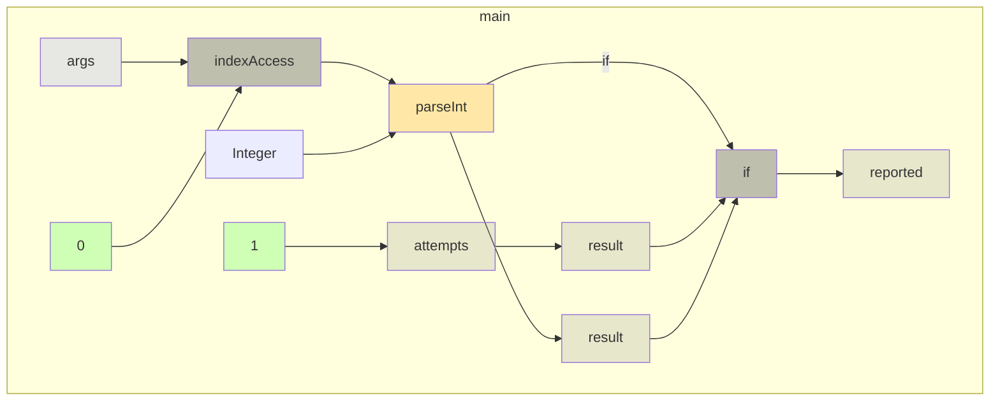

# tryCatch: spike value graph (condensed)

```mermaid
flowchart TD
  subgraph m0["main"]
    n0["indexAccess"]:::BIN_OP
    n1["parseInt"]:::EXTERNAL
    n2["args"]:::FUNC_PARAM
    n3["if"]:::BIN_OP
    n4["0"]:::LITERAL
    n5["1"]:::LITERAL
    n6["Integer"]:::OBJ_VARIABLE
    n7["attempts"]:::VARIABLE
    n8["reported"]:::VARIABLE
    n9["result"]:::VARIABLE
    n10["result"]:::VARIABLE
  end
  n0 --> n1
  n1 --> n9
  n1 -->|if| n3
  n10 --> n3
  n2 --> n0
  n3 --> n8
  n4 --> n0
  n5 --> n7
  n6 --> n1
  n7 --> n10
  n9 --> n3
  classDef LITERAL fill:#00FF0030
  classDef VARIABLE fill:#80808030
  classDef BIN_OP fill:#80808080
  classDef FUNC_PARAM fill:#8080FF30
  classDef RETURN fill:#FF808080
  classDef EXTERNAL fill:#FFA50040
  classDef UNMODELLED fill:#FF000030,stroke-dasharray: 4 2
```
