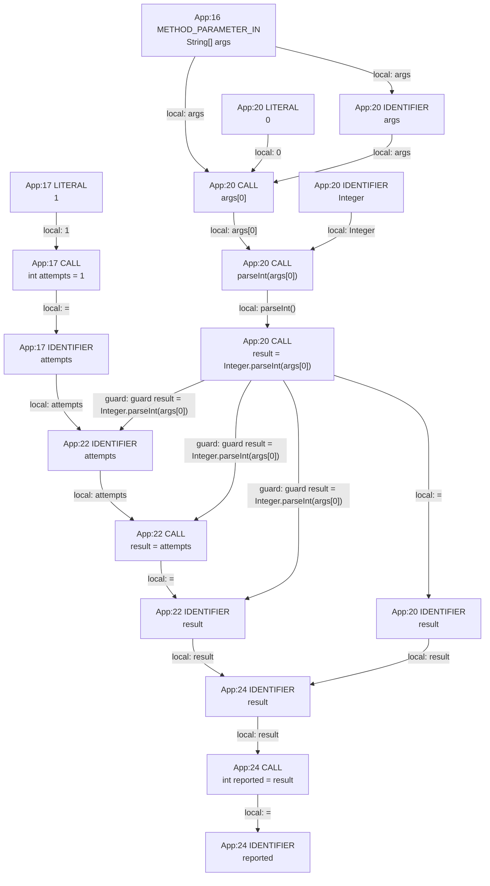

# tryCatch: spike value graph

```mermaid
flowchart TD
  n0["App:16 METHOD_PARAMETER_IN<br/>String[] args"]
  n1["App:17 CALL<br/>int attempts = 1"]
  n2["App:17 IDENTIFIER<br/>attempts"]
  n3["App:17 LITERAL<br/>1"]
  n4["App:20 CALL<br/>args[0]"]
  n5["App:20 CALL<br/>parseInt(args[0])"]
  n6["App:20 CALL<br/>result = Integer.parseInt(args[0])"]
  n7["App:20 IDENTIFIER<br/>Integer"]
  n8["App:20 IDENTIFIER<br/>args"]
  n9["App:20 IDENTIFIER<br/>result"]
  n10["App:20 LITERAL<br/>0"]
  n11["App:22 CALL<br/>result = attempts"]
  n12["App:22 IDENTIFIER<br/>attempts"]
  n13["App:22 IDENTIFIER<br/>result"]
  n14["App:24 CALL<br/>int reported = result"]
  n15["App:24 IDENTIFIER<br/>reported"]
  n16["App:24 IDENTIFIER<br/>result"]
  n0 -->|"local: args"| n4
  n0 -->|"local: args"| n8
  n1 -->|"local: ="| n2
  n10 -->|"local: 0"| n4
  n11 -->|"local: ="| n13
  n12 -->|"local: attempts"| n11
  n13 -->|"local: result"| n16
  n14 -->|"local: ="| n15
  n16 -->|"local: result"| n14
  n2 -->|"local: attempts"| n12
  n3 -->|"local: 1"| n1
  n4 -->|"local: args[0]"| n5
  n5 -->|"local: parseInt()"| n6
  n6 -->|"guard: guard result = Integer.parseInt(args[0])"| n11
  n6 -->|"guard: guard result = Integer.parseInt(args[0])"| n12
  n6 -->|"guard: guard result = Integer.parseInt(args[0])"| n13
  n6 -->|"local: ="| n9
  n7 -->|"local: Integer"| n5
  n8 -->|"local: args"| n4
  n9 -->|"local: result"| n16
```
