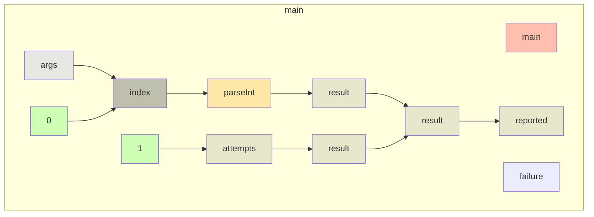

```mermaid
flowchart TD
  subgraph b0["main"]
    n1[main]:::RETURN
    n2[args]:::FUNC_PARAM
    n3[1]:::LITERAL
    n4[attempts]:::VARIABLE
    n5[0]:::LITERAL
    n6[index]:::BIN_OP
    n7[parseInt]:::EXTERNAL
    n8[result]:::VARIABLE
    n9[failure]:::OBJ_VARIABLE
    n10[result]:::VARIABLE
    n11[result]:::VARIABLE
    n12[reported]:::VARIABLE
    n2[args]:::FUNC_PARAM --> n6[index]:::BIN_OP
    n3[1]:::LITERAL --> n4[attempts]:::VARIABLE
    n4[attempts]:::VARIABLE --> n10[result]:::VARIABLE
    n5[0]:::LITERAL --> n6[index]:::BIN_OP
    n6[index]:::BIN_OP --> n7[parseInt]:::EXTERNAL
    n7[parseInt]:::EXTERNAL --> n8[result]:::VARIABLE
    n8[result]:::VARIABLE --> n11[result]:::VARIABLE
    n10[result]:::VARIABLE --> n11[result]:::VARIABLE
    n11[result]:::VARIABLE --> n12[reported]:::VARIABLE
  end
  classDef LITERAL fill:#00FF0030
  classDef VARIABLE fill:#80808030
  classDef BIN_OP fill:#80808080
  classDef FUNC_PARAM fill:#8080FF30
  classDef RETURN fill:#FF808080
  classDef EXTERNAL fill:#FFA50040
  classDef UNMODELLED fill:#FF000030,stroke-dasharray: 4 2
```
