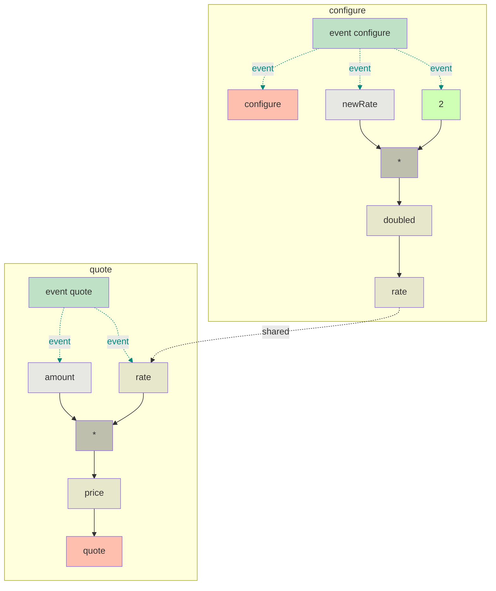

```mermaid
flowchart TD
  subgraph b0["configure"]
    n1[event configure]:::EVENT
    n2[configure]:::RETURN
    n3[newRate]:::FUNC_PARAM
    n4[2]:::LITERAL
    n5[*]:::BIN_OP
    n6[doubled]:::VARIABLE
    n7[rate]:::VARIABLE
    n1[event configure]:::EVENT -. event .-> n2[configure]:::RETURN
    n1[event configure]:::EVENT -. event .-> n3[newRate]:::FUNC_PARAM
    n1[event configure]:::EVENT -. event .-> n4[2]:::LITERAL
    n3[newRate]:::FUNC_PARAM --> n5[*]:::BIN_OP
    n4[2]:::LITERAL --> n5[*]:::BIN_OP
    n5[*]:::BIN_OP --> n6[doubled]:::VARIABLE
    n6[doubled]:::VARIABLE --> n7[rate]:::VARIABLE
  end
  subgraph b8["quote"]
    n9[event quote]:::EVENT
    n10[quote]:::RETURN
    n11[amount]:::FUNC_PARAM
    n12[rate]:::VARIABLE
    n13[*]:::BIN_OP
    n14[price]:::VARIABLE
    n9[event quote]:::EVENT -. event .-> n11[amount]:::FUNC_PARAM
    n9[event quote]:::EVENT -. event .-> n12[rate]:::VARIABLE
    n11[amount]:::FUNC_PARAM --> n13[*]:::BIN_OP
    n12[rate]:::VARIABLE --> n13[*]:::BIN_OP
    n13[*]:::BIN_OP --> n14[price]:::VARIABLE
    n14[price]:::VARIABLE --> n10[quote]:::RETURN
  end
  n7[rate]:::VARIABLE -. shared .-> n12[rate]:::VARIABLE
  linkStyle 0 stroke:#00897b,color:#00897b
  linkStyle 1 stroke:#00897b,color:#00897b
  linkStyle 2 stroke:#00897b,color:#00897b
  linkStyle 7 stroke:#00897b,color:#00897b
  linkStyle 8 stroke:#00897b,color:#00897b
  classDef LITERAL fill:#00FF0030
  classDef VARIABLE fill:#80808030
  classDef BIN_OP fill:#80808080
  classDef FUNC_PARAM fill:#8080FF30
  classDef RETURN fill:#FF808080
  classDef EXTERNAL fill:#FFA50040
  classDef UNMODELLED fill:#FF000030,stroke-dasharray: 4 2
  classDef EVENT fill:#00897B40
```
