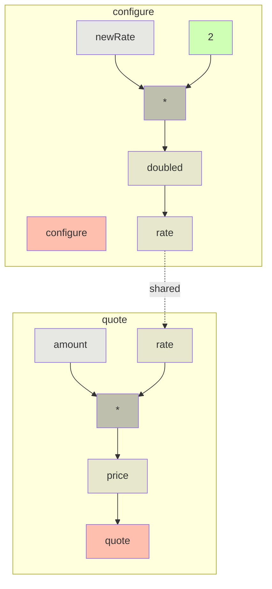

```mermaid
flowchart TD
  subgraph b0["configure"]
    n1[configure]:::RETURN
    n2[newRate]:::FUNC_PARAM
    n3[2]:::LITERAL
    n4[*]:::BIN_OP
    n5[doubled]:::VARIABLE
    n6[rate]:::VARIABLE
    n2[newRate]:::FUNC_PARAM --> n4[*]:::BIN_OP
    n3[2]:::LITERAL --> n4[*]:::BIN_OP
    n4[*]:::BIN_OP --> n5[doubled]:::VARIABLE
    n5[doubled]:::VARIABLE --> n6[rate]:::VARIABLE
  end
  subgraph b7["quote"]
    n8[quote]:::RETURN
    n9[amount]:::FUNC_PARAM
    n10[rate]:::VARIABLE
    n11[*]:::BIN_OP
    n12[price]:::VARIABLE
    n9[amount]:::FUNC_PARAM --> n11[*]:::BIN_OP
    n10[rate]:::VARIABLE --> n11[*]:::BIN_OP
    n11[*]:::BIN_OP --> n12[price]:::VARIABLE
    n12[price]:::VARIABLE --> n8[quote]:::RETURN
  end
  n6[rate]:::VARIABLE -. shared .-> n10[rate]:::VARIABLE
  classDef LITERAL fill:#00FF0030
  classDef VARIABLE fill:#80808030
  classDef BIN_OP fill:#80808080
  classDef FUNC_PARAM fill:#8080FF30
  classDef RETURN fill:#FF808080
  classDef EXTERNAL fill:#FFA50040
  classDef UNMODELLED fill:#FF000030,stroke-dasharray: 4 2
```
