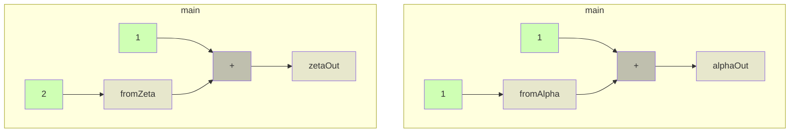

# twoMains: spike value graph (condensed)

```mermaid
flowchart TD
  subgraph m0["main"]
    n0["+"]:::BIN_OP
    n1["1"]:::LITERAL
    n2["1"]:::LITERAL
    n3["alphaOut"]:::VARIABLE
    n4["fromAlpha"]:::VARIABLE
  end
  subgraph m1["main"]
    n5["+"]:::BIN_OP
    n6["1"]:::LITERAL
    n7["2"]:::LITERAL
    n8["fromZeta"]:::VARIABLE
    n9["zetaOut"]:::VARIABLE
  end
  n0 --> n3
  n1 --> n4
  n2 --> n0
  n4 --> n0
  n5 --> n9
  n6 --> n5
  n7 --> n8
  n8 --> n5
  classDef LITERAL fill:#00FF0030
  classDef VARIABLE fill:#80808030
  classDef BIN_OP fill:#80808080
  classDef FUNC_PARAM fill:#8080FF30
  classDef RETURN fill:#FF808080
  classDef EXTERNAL fill:#FFA50040
  classDef UNMODELLED fill:#FF000030,stroke-dasharray: 4 2
```
