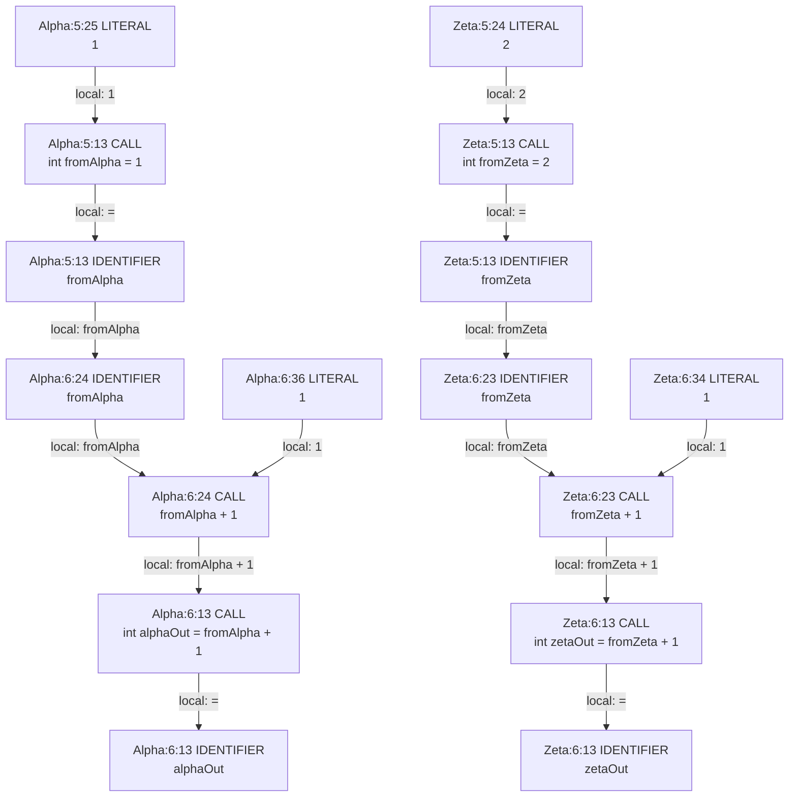

# twoMains: spike value graph

```mermaid
flowchart TD
  n0["Alpha:5:13 CALL<br/>int fromAlpha = 1"]
  n1["Alpha:5:13 IDENTIFIER<br/>fromAlpha"]
  n2["Alpha:5:25 LITERAL<br/>1"]
  n3["Alpha:6:13 CALL<br/>int alphaOut = fromAlpha + 1"]
  n4["Alpha:6:13 IDENTIFIER<br/>alphaOut"]
  n5["Alpha:6:24 CALL<br/>fromAlpha + 1"]
  n6["Alpha:6:24 IDENTIFIER<br/>fromAlpha"]
  n7["Alpha:6:36 LITERAL<br/>1"]
  n8["Zeta:5:13 CALL<br/>int fromZeta = 2"]
  n9["Zeta:5:13 IDENTIFIER<br/>fromZeta"]
  n10["Zeta:5:24 LITERAL<br/>2"]
  n11["Zeta:6:13 CALL<br/>int zetaOut = fromZeta + 1"]
  n12["Zeta:6:13 IDENTIFIER<br/>zetaOut"]
  n13["Zeta:6:23 CALL<br/>fromZeta + 1"]
  n14["Zeta:6:23 IDENTIFIER<br/>fromZeta"]
  n15["Zeta:6:34 LITERAL<br/>1"]
  n0 -->|"local: ="| n1
  n1 -->|"local: fromAlpha"| n6
  n10 -->|"local: 2"| n8
  n11 -->|"local: ="| n12
  n13 -->|"local: fromZeta + 1"| n11
  n14 -->|"local: fromZeta"| n13
  n15 -->|"local: 1"| n13
  n2 -->|"local: 1"| n0
  n3 -->|"local: ="| n4
  n5 -->|"local: fromAlpha + 1"| n3
  n6 -->|"local: fromAlpha"| n5
  n7 -->|"local: 1"| n5
  n8 -->|"local: ="| n9
  n9 -->|"local: fromZeta"| n14
```
