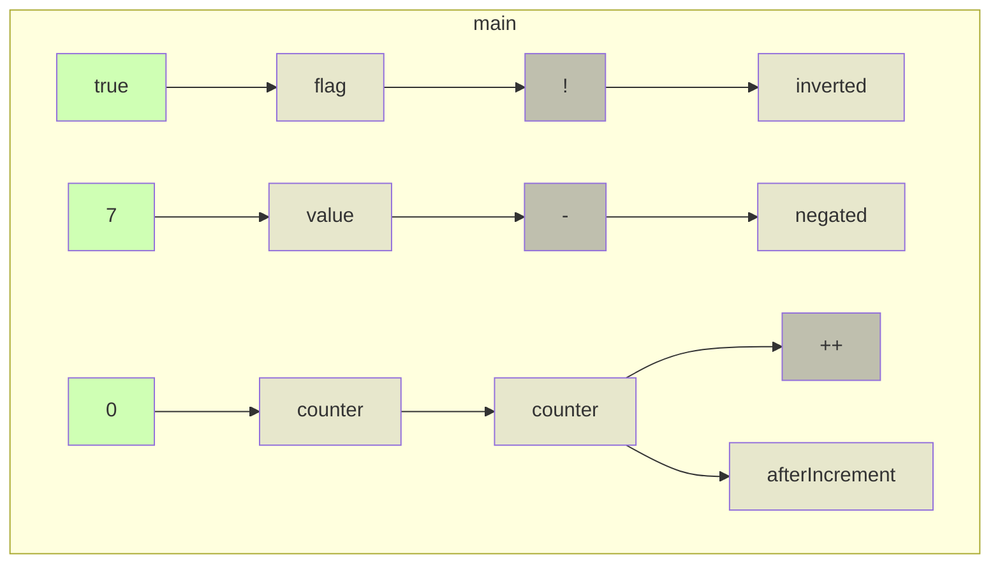

# unary: spike value graph (condensed)

```mermaid
flowchart TD
  subgraph m0["main"]
    n0["!"]:::BIN_OP
    n1["++"]:::BIN_OP
    n2["-"]:::BIN_OP
    n3["0"]:::LITERAL
    n4["7"]:::LITERAL
    n5["true"]:::LITERAL
    n6["afterIncrement"]:::VARIABLE
    n7["counter"]:::VARIABLE
    n8["counter"]:::VARIABLE
    n9["flag"]:::VARIABLE
    n10["inverted"]:::VARIABLE
    n11["negated"]:::VARIABLE
    n12["value"]:::VARIABLE
  end
  n0 --> n10
  n12 --> n2
  n2 --> n11
  n3 --> n7
  n4 --> n12
  n5 --> n9
  n7 --> n8
  n8 --> n1
  n8 --> n6
  n9 --> n0
  classDef LITERAL fill:#00FF0030
  classDef VARIABLE fill:#80808030
  classDef BIN_OP fill:#80808080
  classDef FUNC_PARAM fill:#8080FF30
  classDef RETURN fill:#FF808080
  classDef EXTERNAL fill:#FFA50040
  classDef UNMODELLED fill:#FF000030,stroke-dasharray: 4 2
```
