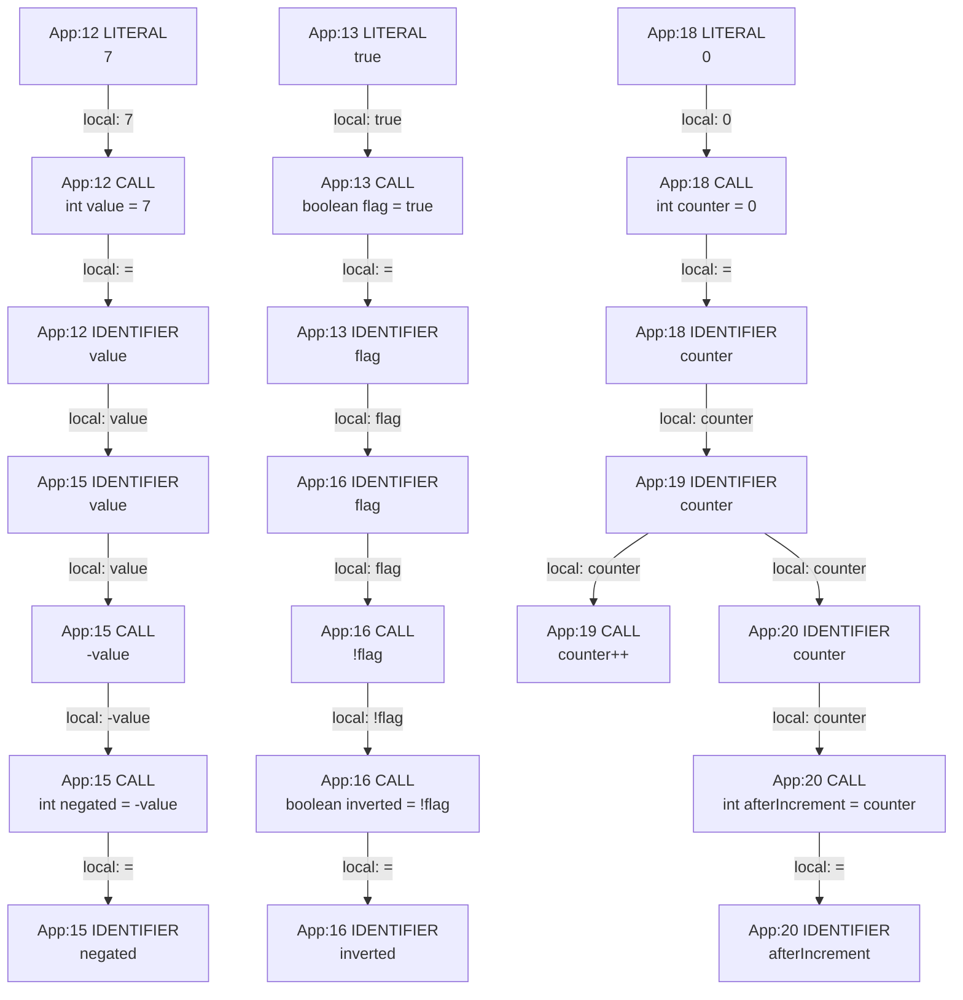

# unary: spike value graph

```mermaid
flowchart TD
  n0["App:12 CALL<br/>int value = 7"]
  n1["App:12 IDENTIFIER<br/>value"]
  n2["App:12 LITERAL<br/>7"]
  n3["App:13 CALL<br/>boolean flag = true"]
  n4["App:13 IDENTIFIER<br/>flag"]
  n5["App:13 LITERAL<br/>true"]
  n6["App:15 CALL<br/>-value"]
  n7["App:15 CALL<br/>int negated = -value"]
  n8["App:15 IDENTIFIER<br/>negated"]
  n9["App:15 IDENTIFIER<br/>value"]
  n10["App:16 CALL<br/>!flag"]
  n11["App:16 CALL<br/>boolean inverted = !flag"]
  n12["App:16 IDENTIFIER<br/>flag"]
  n13["App:16 IDENTIFIER<br/>inverted"]
  n14["App:18 CALL<br/>int counter = 0"]
  n15["App:18 IDENTIFIER<br/>counter"]
  n16["App:18 LITERAL<br/>0"]
  n17["App:19 CALL<br/>counter++"]
  n18["App:19 IDENTIFIER<br/>counter"]
  n19["App:20 CALL<br/>int afterIncrement = counter"]
  n20["App:20 IDENTIFIER<br/>afterIncrement"]
  n21["App:20 IDENTIFIER<br/>counter"]
  n0 -->|"local: ="| n1
  n1 -->|"local: value"| n9
  n10 -->|"local: !flag"| n11
  n11 -->|"local: ="| n13
  n12 -->|"local: flag"| n10
  n14 -->|"local: ="| n15
  n15 -->|"local: counter"| n18
  n16 -->|"local: 0"| n14
  n18 -->|"local: counter"| n17
  n18 -->|"local: counter"| n21
  n19 -->|"local: ="| n20
  n2 -->|"local: 7"| n0
  n21 -->|"local: counter"| n19
  n3 -->|"local: ="| n4
  n4 -->|"local: flag"| n12
  n5 -->|"local: true"| n3
  n6 -->|"local: -value"| n7
  n7 -->|"local: ="| n8
  n9 -->|"local: value"| n6
```
