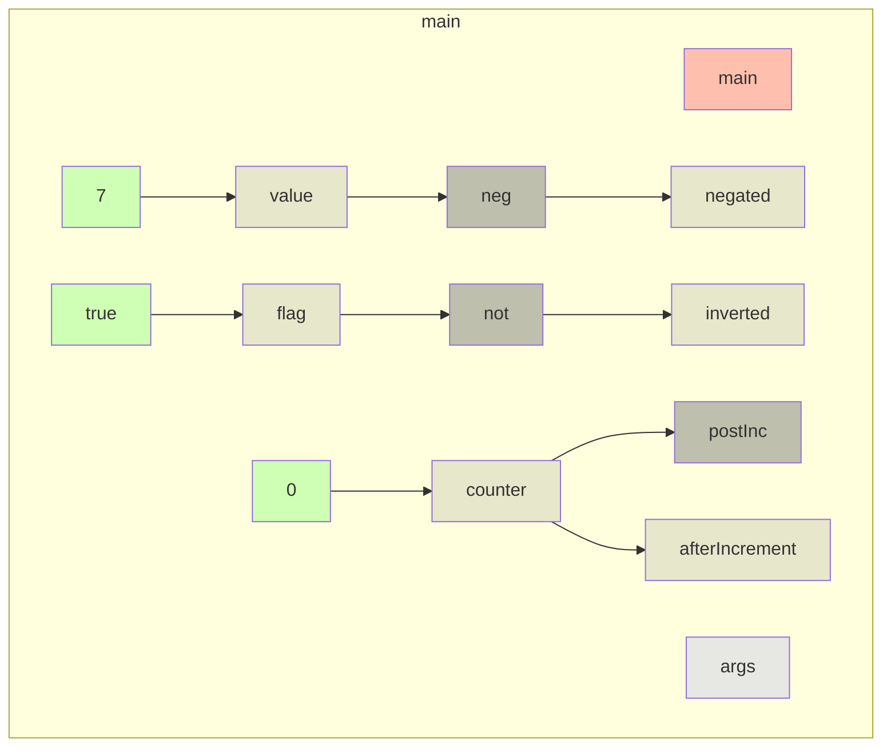

```mermaid
flowchart TD
  subgraph b0["main"]
    n1[main]:::RETURN
    n2[args]:::FUNC_PARAM
    n3[7]:::LITERAL
    n4[value]:::VARIABLE
    n5[true]:::LITERAL
    n6[flag]:::VARIABLE
    n7[neg]:::BIN_OP
    n8[negated]:::VARIABLE
    n9[not]:::BIN_OP
    n10[inverted]:::VARIABLE
    n11[0]:::LITERAL
    n12[counter]:::VARIABLE
    n13[postInc]:::BIN_OP
    n14[afterIncrement]:::VARIABLE
    n3[7]:::LITERAL --> n4[value]:::VARIABLE
    n4[value]:::VARIABLE --> n7[neg]:::BIN_OP
    n5[true]:::LITERAL --> n6[flag]:::VARIABLE
    n6[flag]:::VARIABLE --> n9[not]:::BIN_OP
    n7[neg]:::BIN_OP --> n8[negated]:::VARIABLE
    n9[not]:::BIN_OP --> n10[inverted]:::VARIABLE
    n11[0]:::LITERAL --> n12[counter]:::VARIABLE
    n12[counter]:::VARIABLE --> n13[postInc]:::BIN_OP
    n12[counter]:::VARIABLE --> n14[afterIncrement]:::VARIABLE
  end
  classDef LITERAL fill:#00FF0030
  classDef VARIABLE fill:#80808030
  classDef BIN_OP fill:#80808080
  classDef FUNC_PARAM fill:#8080FF30
  classDef RETURN fill:#FF808080
  classDef EXTERNAL fill:#FFA50040
```
