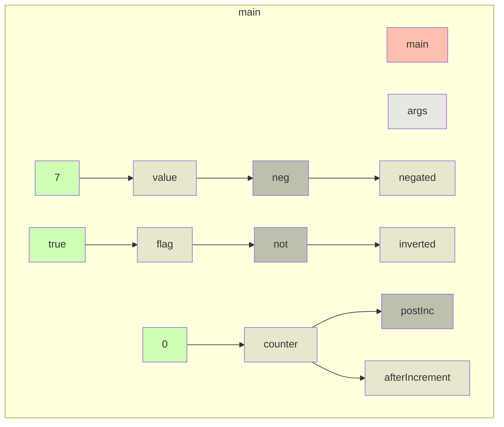

```mermaid
flowchart TD
  subgraph 4309014["main"]
    -14940633005[afterIncrement]:::VARIABLE
    -5696010009[postInc]:::BIN_OP
    56853577[main]:::RETURN
    954821337[7]:::LITERAL
    954944284[0]:::LITERAL
    956733147[neg]:::BIN_OP
    956771344[not]:::BIN_OP
    1005752563[args]:::FUNC_PARAM
    1008298390[flag]:::VARIABLE
    1015523929[true]:::LITERAL
    2858330860[value]:::VARIABLE
    11625359449[inverted]:::VARIABLE
    17238060612[counter]:::VARIABLE
    32078938741[negated]:::VARIABLE
    954821337[7]:::LITERAL --> 2858330860[value]:::VARIABLE
    954944284[0]:::LITERAL --> 17238060612[counter]:::VARIABLE
    956733147[neg]:::BIN_OP --> 32078938741[negated]:::VARIABLE
    956771344[not]:::BIN_OP --> 11625359449[inverted]:::VARIABLE
    1008298390[flag]:::VARIABLE --> 956771344[not]:::BIN_OP
    1015523929[true]:::LITERAL --> 1008298390[flag]:::VARIABLE
    2858330860[value]:::VARIABLE --> 956733147[neg]:::BIN_OP
    17238060612[counter]:::VARIABLE --> -5696010009[postInc]:::BIN_OP
    17238060612[counter]:::VARIABLE --> -14940633005[afterIncrement]:::VARIABLE
  end
  classDef LITERAL fill:#00FF0030
  classDef VARIABLE fill:#80808030
  classDef BIN_OP fill:#80808080
  classDef FUNC_PARAM fill:#8080FF30
  classDef RETURN fill:#FF808080
  classDef EXTERNAL fill:#FFA50040
```
