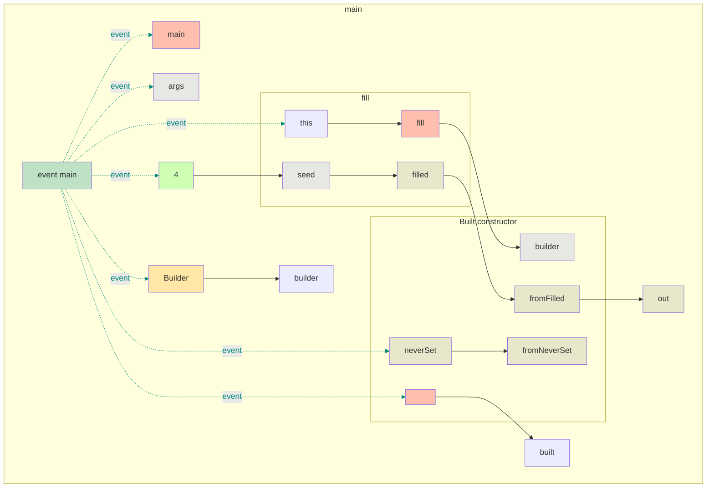

```mermaid
flowchart TD
  subgraph b0["main"]
    n1[event main]:::EVENT
    n2[main]:::RETURN
    n3[args]:::FUNC_PARAM
    n4[Builder]:::EXTERNAL
    n5[builder]:::OBJ_VARIABLE
    n6[4]:::LITERAL
    n18[built]:::OBJ_VARIABLE
    n19[out]:::VARIABLE
    n1[event main]:::EVENT -. event .-> n2[main]:::RETURN
    n1[event main]:::EVENT -. event .-> n3[args]:::FUNC_PARAM
    n1[event main]:::EVENT -. event .-> n4[Builder]:::EXTERNAL
    n1[event main]:::EVENT -. event .-> n6[4]:::LITERAL
    n1[event main]:::EVENT -. event .-> n11[this]:::OBJ_VARIABLE
    n1[event main]:::EVENT -. event .-> n13[<init>]:::RETURN
    n1[event main]:::EVENT -. event .-> n16[neverSet]:::VARIABLE
    n4[Builder]:::EXTERNAL --> n5[builder]:::OBJ_VARIABLE
    n6[4]:::LITERAL --> n9[seed]:::FUNC_PARAM
    n8[fill]:::RETURN --> n14[builder]:::FUNC_PARAM
    n10[filled]:::VARIABLE --> n15[fromFilled]:::VARIABLE
    n13[<init>]:::RETURN --> n18[built]:::OBJ_VARIABLE
    n15[fromFilled]:::VARIABLE --> n19[out]:::VARIABLE
    subgraph b7["fill"]
      n8[fill]:::RETURN
      n9[seed]:::FUNC_PARAM
      n10[filled]:::VARIABLE
      n11[this]:::OBJ_VARIABLE
      n9[seed]:::FUNC_PARAM --> n10[filled]:::VARIABLE
      n11[this]:::OBJ_VARIABLE --> n8[fill]:::RETURN
    end
    subgraph b12["Built.constructor"]
      n13[<init>]:::RETURN
      n14[builder]:::FUNC_PARAM
      n15[fromFilled]:::VARIABLE
      n16[neverSet]:::VARIABLE
      n17[fromNeverSet]:::VARIABLE
      n16[neverSet]:::VARIABLE --> n17[fromNeverSet]:::VARIABLE
    end
  end
  linkStyle 0 stroke:#00897b,color:#00897b
  linkStyle 1 stroke:#00897b,color:#00897b
  linkStyle 2 stroke:#00897b,color:#00897b
  linkStyle 3 stroke:#00897b,color:#00897b
  linkStyle 4 stroke:#00897b,color:#00897b
  linkStyle 5 stroke:#00897b,color:#00897b
  linkStyle 6 stroke:#00897b,color:#00897b
  classDef LITERAL fill:#00FF0030
  classDef VARIABLE fill:#80808030
  classDef BIN_OP fill:#80808080
  classDef FUNC_PARAM fill:#8080FF30
  classDef RETURN fill:#FF808080
  classDef EXTERNAL fill:#FFA50040
  classDef UNMODELLED fill:#FF000030,stroke-dasharray: 4 2
  classDef EVENT fill:#00897B40
```
