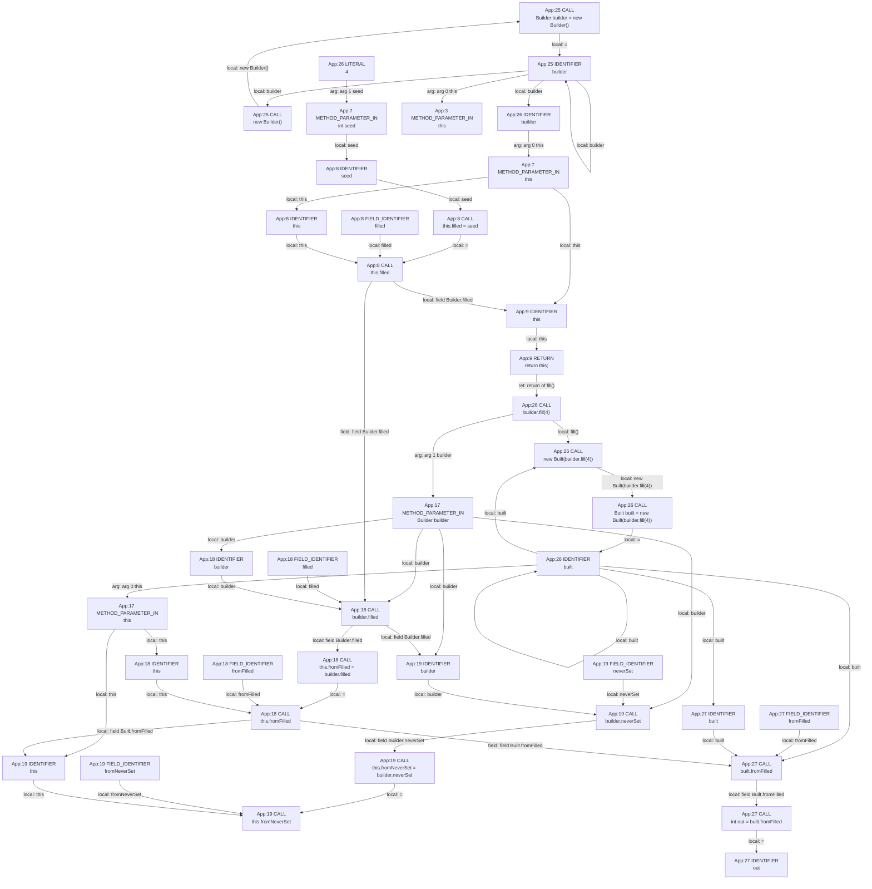

# unassignedField: spike value graph

```mermaid
flowchart TD
  n0["App:17 METHOD_PARAMETER_IN<br/>Builder builder"]
  n1["App:17 METHOD_PARAMETER_IN<br/>this"]
  n2["App:18 CALL<br/>builder.filled"]
  n3["App:18 CALL<br/>this.fromFilled"]
  n4["App:18 CALL<br/>this.fromFilled = builder.filled"]
  n5["App:18 FIELD_IDENTIFIER<br/>filled"]
  n6["App:18 FIELD_IDENTIFIER<br/>fromFilled"]
  n7["App:18 IDENTIFIER<br/>builder"]
  n8["App:18 IDENTIFIER<br/>this"]
  n9["App:19 CALL<br/>builder.neverSet"]
  n10["App:19 CALL<br/>this.fromNeverSet"]
  n11["App:19 CALL<br/>this.fromNeverSet = builder.neverSet"]
  n12["App:19 FIELD_IDENTIFIER<br/>fromNeverSet"]
  n13["App:19 FIELD_IDENTIFIER<br/>neverSet"]
  n14["App:19 IDENTIFIER<br/>builder"]
  n15["App:19 IDENTIFIER<br/>this"]
  n16["App:25 CALL<br/>Builder builder = new Builder()"]
  n17["App:25 CALL<br/>new Builder()"]
  n18["App:25 IDENTIFIER<br/>builder"]
  n19["App:26 CALL<br/>Built built = new Built(builder.fill(4))"]
  n20["App:26 CALL<br/>builder.fill(4)"]
  n21["App:26 CALL<br/>new Built(builder.fill(4))"]
  n22["App:26 IDENTIFIER<br/>builder"]
  n23["App:26 IDENTIFIER<br/>built"]
  n24["App:26 LITERAL<br/>4"]
  n25["App:27 CALL<br/>built.fromFilled"]
  n26["App:27 CALL<br/>int out = built.fromFilled"]
  n27["App:27 FIELD_IDENTIFIER<br/>fromFilled"]
  n28["App:27 IDENTIFIER<br/>built"]
  n29["App:27 IDENTIFIER<br/>out"]
  n30["App:3 METHOD_PARAMETER_IN<br/>this"]
  n31["App:7 METHOD_PARAMETER_IN<br/>int seed"]
  n32["App:7 METHOD_PARAMETER_IN<br/>this"]
  n33["App:8 CALL<br/>this.filled"]
  n34["App:8 CALL<br/>this.filled = seed"]
  n35["App:8 FIELD_IDENTIFIER<br/>filled"]
  n36["App:8 IDENTIFIER<br/>seed"]
  n37["App:8 IDENTIFIER<br/>this"]
  n38["App:9 IDENTIFIER<br/>this"]
  n39["App:9 RETURN<br/>return this;"]
  n0 -->|"local: builder"| n14
  n0 -->|"local: builder"| n2
  n0 -->|"local: builder"| n7
  n0 -->|"local: builder"| n9
  n1 -->|"local: this"| n15
  n1 -->|"local: this"| n8
  n11 -->|"local: ="| n10
  n12 -->|"local: fromNeverSet"| n10
  n13 -->|"local: neverSet"| n9
  n14 -->|"local: builder"| n9
  n15 -->|"local: this"| n10
  n16 -->|"local: ="| n18
  n17 -->|"local: new Builder()"| n16
  n18 -->|"arg: arg 0 this"| n30
  n18 -->|"local: builder"| n17
  n18 -->|"local: builder"| n18
  n18 -->|"local: builder"| n22
  n19 -->|"local: ="| n23
  n2 -->|"local: field Builder.filled"| n14
  n2 -->|"local: field Builder.filled"| n4
  n20 -->|"arg: arg 1 builder"| n0
  n20 -->|"local: fill()"| n21
  n21 -->|"local: new Built(builder.fill(4))"| n19
  n22 -->|"arg: arg 0 this"| n32
  n23 -->|"arg: arg 0 this"| n1
  n23 -->|"local: built"| n21
  n23 -->|"local: built"| n23
  n23 -->|"local: built"| n25
  n23 -->|"local: built"| n28
  n24 -->|"arg: arg 1 seed"| n31
  n25 -->|"local: field Built.fromFilled"| n26
  n26 -->|"local: ="| n29
  n27 -->|"local: fromFilled"| n25
  n28 -->|"local: built"| n25
  n3 -->|"field: field Built.fromFilled"| n25
  n3 -->|"local: field Built.fromFilled"| n15
  n31 -->|"local: seed"| n36
  n32 -->|"local: this"| n37
  n32 -->|"local: this"| n38
  n33 -->|"field: field Builder.filled"| n2
  n33 -->|"local: field Builder.filled"| n38
  n34 -->|"local: ="| n33
  n35 -->|"local: filled"| n33
  n36 -->|"local: seed"| n34
  n37 -->|"local: this"| n33
  n38 -->|"local: this"| n39
  n39 -->|"ret: return of fill()"| n20
  n4 -->|"local: ="| n3
  n5 -->|"local: filled"| n2
  n6 -->|"local: fromFilled"| n3
  n7 -->|"local: builder"| n2
  n8 -->|"local: this"| n3
  n9 -->|"local: field Builder.neverSet"| n11
```
