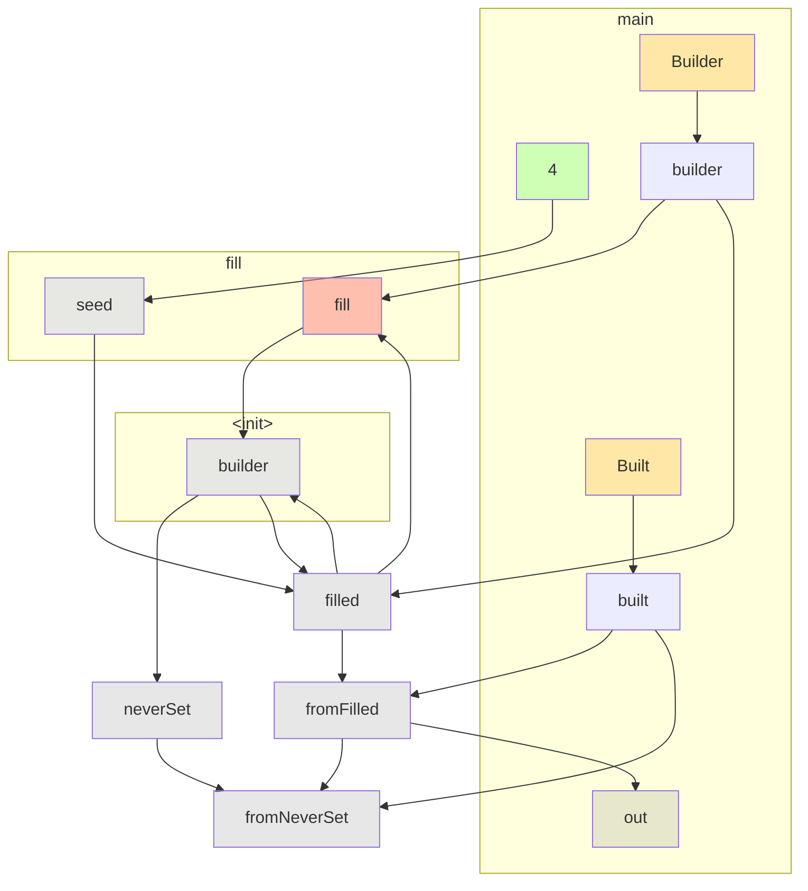

# unassignedField: spike value graph (condensed)

```mermaid
flowchart TD
  subgraph m0["main"]
    n0["Builder"]:::EXTERNAL
    n1["Built"]:::EXTERNAL
    n2["4"]:::LITERAL
    n3["builder"]:::OBJ_VARIABLE
    n4["built"]:::OBJ_VARIABLE
    n5["out"]:::VARIABLE
  end
  subgraph m1["fill"]
    n6["seed"]:::FUNC_PARAM
    n7["fill"]:::RETURN
  end
  subgraph m2["#lt;init#gt;"]
    n8["builder"]:::FUNC_PARAM
  end
  n9["filled"]:::VARIABLE
  n10["neverSet"]:::VARIABLE
  n11["fromFilled"]:::VARIABLE
  n12["fromNeverSet"]:::VARIABLE
  n0 --> n3
  n1 --> n4
  n10 --> n12
  n11 --> n12
  n11 --> n5
  n2 --> n6
  n3 --> n7
  n3 --> n9
  n4 --> n11
  n4 --> n12
  n6 --> n9
  n7 --> n8
  n8 --> n10
  n8 --> n9
  n9 --> n11
  n9 --> n7
  n9 --> n8
  classDef LITERAL fill:#00FF0030
  classDef VARIABLE fill:#80808030
  classDef BIN_OP fill:#80808080
  classDef FUNC_PARAM fill:#8080FF30
  classDef RETURN fill:#FF808080
  classDef EXTERNAL fill:#FFA50040
  classDef UNMODELLED fill:#FF000030,stroke-dasharray: 4 2
```
