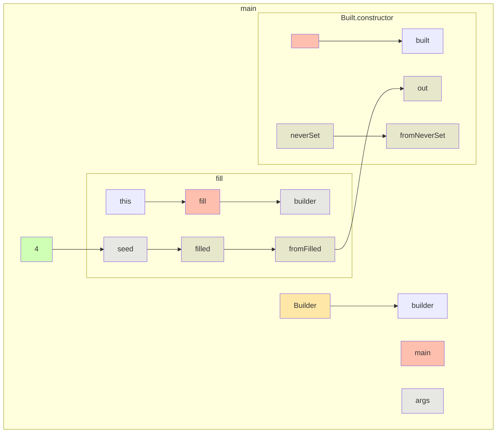

```mermaid
flowchart TD
  subgraph b0["main"]
    n1[main]:::RETURN
    n2[args]:::FUNC_PARAM
    n3[builder]:::OBJ_VARIABLE
    n4[Builder]:::EXTERNAL
    n5[built]:::OBJ_VARIABLE
    n6[4]:::LITERAL
    n18[out]:::VARIABLE
    n4[Builder]:::EXTERNAL --> n3[builder]:::OBJ_VARIABLE
    n6[4]:::LITERAL --> n9[seed]:::FUNC_PARAM
    subgraph b7["fill"]
      n8[fill]:::RETURN
      n9[seed]:::FUNC_PARAM
      n10[filled]:::VARIABLE
      n11[this]:::OBJ_VARIABLE
      n8[fill]:::RETURN --> n14[builder]:::FUNC_PARAM
      n9[seed]:::FUNC_PARAM --> n10[filled]:::VARIABLE
      n10[filled]:::VARIABLE --> n15[fromFilled]:::VARIABLE
      n11[this]:::OBJ_VARIABLE --> n8[fill]:::RETURN
    end
    subgraph b12["Built.constructor"]
      n13[<init>]:::RETURN
      n14[builder]:::FUNC_PARAM
      n15[fromFilled]:::VARIABLE
      n16[fromNeverSet]:::VARIABLE
      n17[neverSet]:::VARIABLE
      n13[<init>]:::RETURN --> n5[built]:::OBJ_VARIABLE
      n15[fromFilled]:::VARIABLE --> n18[out]:::VARIABLE
      n17[neverSet]:::VARIABLE --> n16[fromNeverSet]:::VARIABLE
    end
  end
  classDef LITERAL fill:#00FF0030
  classDef VARIABLE fill:#80808030
  classDef BIN_OP fill:#80808080
  classDef FUNC_PARAM fill:#8080FF30
  classDef RETURN fill:#FF808080
  classDef EXTERNAL fill:#FFA50040
```
