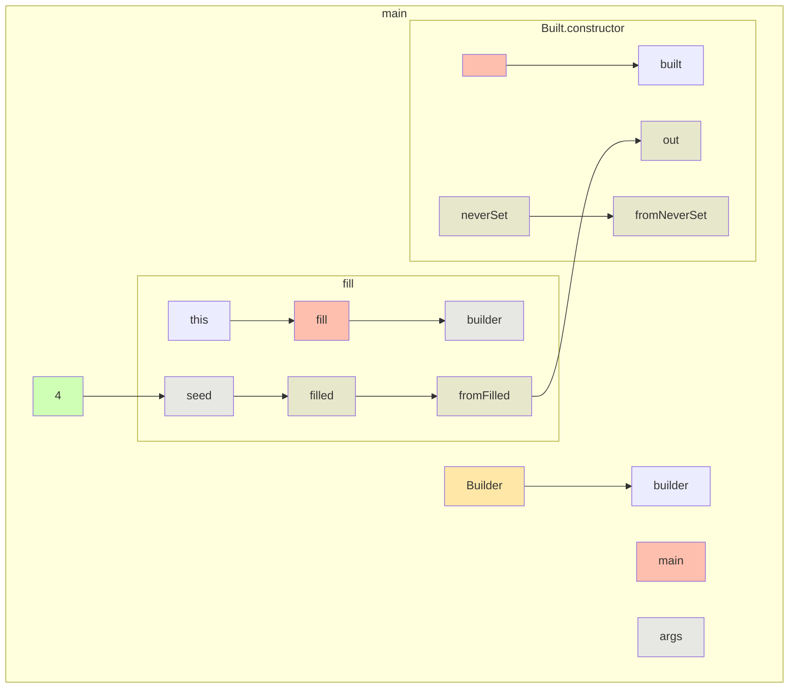

```mermaid
flowchart TD
  subgraph b0["main"]
    n1[main]:::RETURN
    n2[args]:::FUNC_PARAM
    n3[Builder]:::EXTERNAL
    n4[builder]:::OBJ_VARIABLE
    n5[4]:::LITERAL
    n17[built]:::OBJ_VARIABLE
    n18[out]:::VARIABLE
    n3[Builder]:::EXTERNAL --> n4[builder]:::OBJ_VARIABLE
    n5[4]:::LITERAL --> n8[seed]:::FUNC_PARAM
    subgraph b6["fill"]
      n7[fill]:::RETURN
      n8[seed]:::FUNC_PARAM
      n9[filled]:::VARIABLE
      n10[this]:::OBJ_VARIABLE
      n7[fill]:::RETURN --> n13[builder]:::FUNC_PARAM
      n8[seed]:::FUNC_PARAM --> n9[filled]:::VARIABLE
      n9[filled]:::VARIABLE --> n14[fromFilled]:::VARIABLE
      n10[this]:::OBJ_VARIABLE --> n7[fill]:::RETURN
    end
    subgraph b11["Built.constructor"]
      n12[<init>]:::RETURN
      n13[builder]:::FUNC_PARAM
      n14[fromFilled]:::VARIABLE
      n15[neverSet]:::VARIABLE
      n16[fromNeverSet]:::VARIABLE
      n12[<init>]:::RETURN --> n17[built]:::OBJ_VARIABLE
      n14[fromFilled]:::VARIABLE --> n18[out]:::VARIABLE
      n15[neverSet]:::VARIABLE --> n16[fromNeverSet]:::VARIABLE
    end
  end
  classDef LITERAL fill:#00FF0030
  classDef VARIABLE fill:#80808030
  classDef BIN_OP fill:#80808080
  classDef FUNC_PARAM fill:#8080FF30
  classDef RETURN fill:#FF808080
  classDef EXTERNAL fill:#FFA50040
  classDef UNMODELLED fill:#FF000030,stroke-dasharray: 4 2
```
