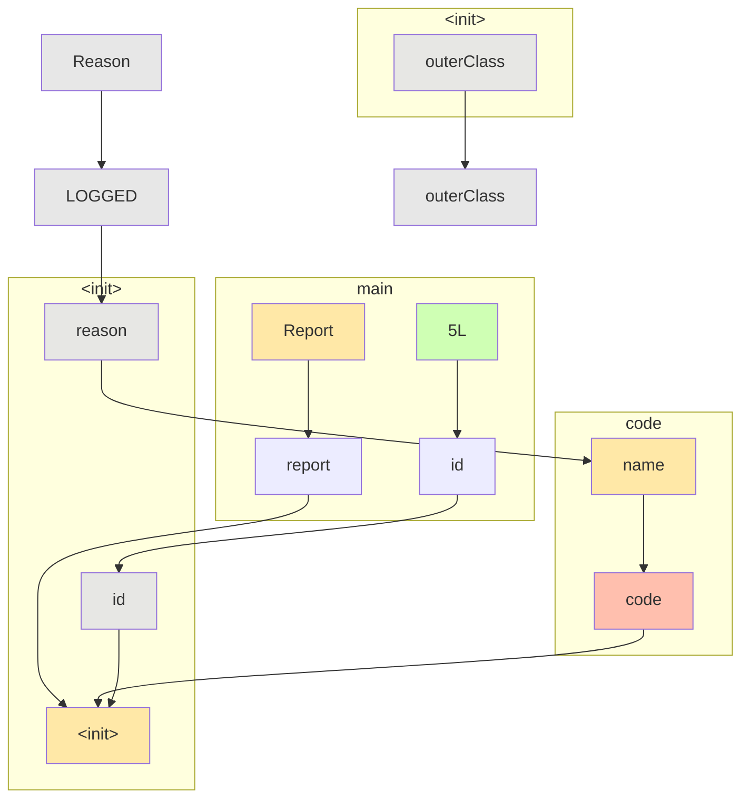

# unattributedParameter: spike value graph (condensed)

```mermaid
flowchart TD
  subgraph m0["main"]
    n0["Report"]:::EXTERNAL
    n1["5L"]:::LITERAL
    n2["id"]:::OBJ_VARIABLE
    n3["report"]:::OBJ_VARIABLE
  end
  subgraph m1["#lt;init#gt;"]
    n4["outerClass"]:::FUNC_PARAM
  end
  subgraph m2["code"]
    n5["name"]:::EXTERNAL
    n6["code"]:::RETURN
  end
  subgraph m3["#lt;init#gt;"]
    n7["#lt;init#gt;"]:::EXTERNAL
    n8["id"]:::FUNC_PARAM
    n9["reason"]:::FUNC_PARAM
  end
  n10["LOGGED"]:::VARIABLE
  n11["outerClass"]:::VARIABLE
  n12["Reason"]:::VARIABLE
  n0 --> n3
  n1 --> n2
  n10 --> n9
  n12 --> n10
  n2 --> n8
  n3 --> n7
  n4 --> n11
  n5 --> n6
  n6 --> n7
  n8 --> n7
  n9 --> n5
  classDef LITERAL fill:#00FF0030
  classDef VARIABLE fill:#80808030
  classDef BIN_OP fill:#80808080
  classDef FUNC_PARAM fill:#8080FF30
  classDef RETURN fill:#FF808080
  classDef EXTERNAL fill:#FFA50040
  classDef UNMODELLED fill:#FF000030,stroke-dasharray: 4 2
```
