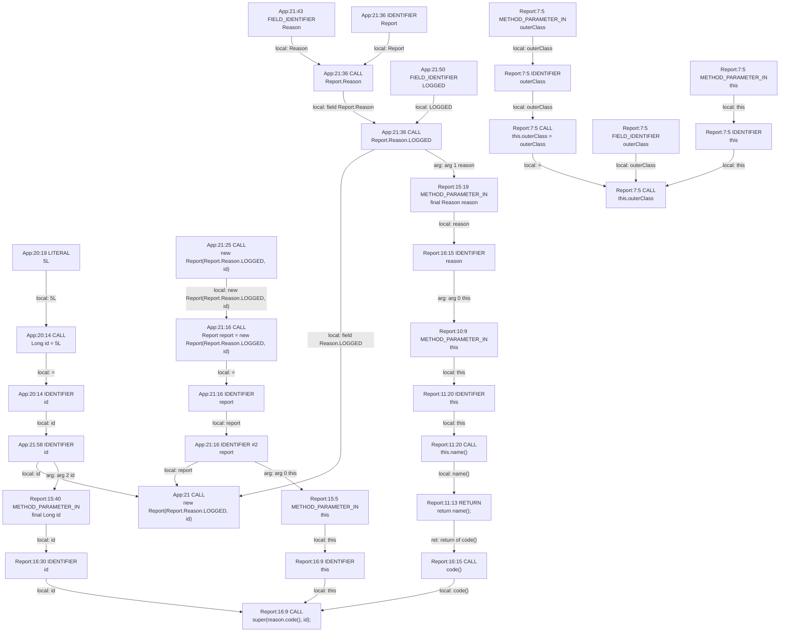

# unattributedParameter: spike value graph

```mermaid
flowchart TD
  n0["App:20:14 CALL<br/>Long id = 5L"]
  n1["App:20:14 IDENTIFIER<br/>id"]
  n2["App:20:19 LITERAL<br/>5L"]
  n3["App:21 CALL<br/>new Report(Report.Reason.LOGGED, id)"]
  n4["App:21:16 CALL<br/>Report report = new Report(Report.Reason.LOGGED, id)"]
  n5["App:21:16 IDENTIFIER #2<br/>report"]
  n6["App:21:16 IDENTIFIER<br/>report"]
  n7["App:21:25 CALL<br/>new Report(Report.Reason.LOGGED, id)"]
  n8["App:21:36 CALL<br/>Report.Reason"]
  n9["App:21:36 CALL<br/>Report.Reason.LOGGED"]
  n10["App:21:36 IDENTIFIER<br/>Report"]
  n11["App:21:43 FIELD_IDENTIFIER<br/>Reason"]
  n12["App:21:50 FIELD_IDENTIFIER<br/>LOGGED"]
  n13["App:21:58 IDENTIFIER<br/>id"]
  n14["Report:10:9 METHOD_PARAMETER_IN<br/>this"]
  n15["Report:11:13 RETURN<br/>return name();"]
  n16["Report:11:20 CALL<br/>this.name()"]
  n17["Report:11:20 IDENTIFIER<br/>this"]
  n18["Report:15:19 METHOD_PARAMETER_IN<br/>final Reason reason"]
  n19["Report:15:40 METHOD_PARAMETER_IN<br/>final Long id"]
  n20["Report:15:5 METHOD_PARAMETER_IN<br/>this"]
  n21["Report:16:15 CALL<br/>code()"]
  n22["Report:16:15 IDENTIFIER<br/>reason"]
  n23["Report:16:30 IDENTIFIER<br/>id"]
  n24["Report:16:9 CALL<br/>super(reason.code(), id);"]
  n25["Report:16:9 IDENTIFIER<br/>this"]
  n26["Report:7:5 CALL<br/>this.outerClass"]
  n27["Report:7:5 CALL<br/>this.outerClass = outerClass"]
  n28["Report:7:5 FIELD_IDENTIFIER<br/>outerClass"]
  n29["Report:7:5 IDENTIFIER<br/>outerClass"]
  n30["Report:7:5 IDENTIFIER<br/>this"]
  n31["Report:7:5 METHOD_PARAMETER_IN<br/>outerClass"]
  n32["Report:7:5 METHOD_PARAMETER_IN<br/>this"]
  n0 -->|"local: ="| n1
  n1 -->|"local: id"| n13
  n10 -->|"local: Report"| n8
  n11 -->|"local: Reason"| n8
  n12 -->|"local: LOGGED"| n9
  n13 -->|"arg: arg 2 id"| n19
  n13 -->|"local: id"| n3
  n14 -->|"local: this"| n17
  n15 -->|"ret: return of code()"| n21
  n16 -->|"local: name()"| n15
  n17 -->|"local: this"| n16
  n18 -->|"local: reason"| n22
  n19 -->|"local: id"| n23
  n2 -->|"local: 5L"| n0
  n20 -->|"local: this"| n25
  n21 -->|"local: code()"| n24
  n22 -->|"arg: arg 0 this"| n14
  n23 -->|"local: id"| n24
  n25 -->|"local: this"| n24
  n27 -->|"local: ="| n26
  n28 -->|"local: outerClass"| n26
  n29 -->|"local: outerClass"| n27
  n30 -->|"local: this"| n26
  n31 -->|"local: outerClass"| n29
  n32 -->|"local: this"| n30
  n4 -->|"local: ="| n6
  n5 -->|"arg: arg 0 this"| n20
  n5 -->|"local: report"| n3
  n6 -->|"local: report"| n5
  n7 -->|"local: new Report(Report.Reason.LOGGED, id)"| n4
  n8 -->|"local: field Report.Reason"| n9
  n9 -->|"arg: arg 1 reason"| n18
  n9 -->|"local: field Reason.LOGGED"| n3
```
