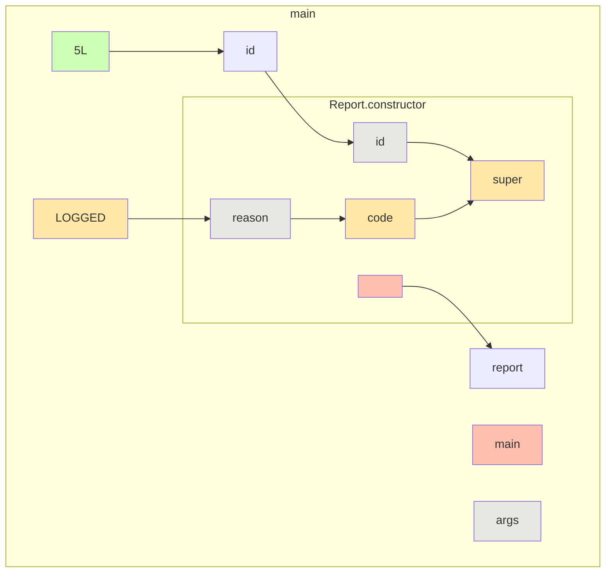

```mermaid
flowchart TD
  subgraph b0["main"]
    n1[main]:::RETURN
    n2[args]:::FUNC_PARAM
    n3[5L]:::LITERAL
    n4[id]:::OBJ_VARIABLE
    n5[LOGGED]:::EXTERNAL
    n12[report]:::OBJ_VARIABLE
    n3[5L]:::LITERAL --> n4[id]:::OBJ_VARIABLE
    n4[id]:::OBJ_VARIABLE --> n9[id]:::FUNC_PARAM
    n5[LOGGED]:::EXTERNAL --> n8[reason]:::FUNC_PARAM
    n7[<init>]:::RETURN --> n12[report]:::OBJ_VARIABLE
    subgraph b6["Report.constructor"]
      n7[<init>]:::RETURN
      n8[reason]:::FUNC_PARAM
      n9[id]:::FUNC_PARAM
      n10[code]:::EXTERNAL
      n11[super]:::EXTERNAL
      n8[reason]:::FUNC_PARAM --> n10[code]:::EXTERNAL
      n9[id]:::FUNC_PARAM --> n11[super]:::EXTERNAL
      n10[code]:::EXTERNAL --> n11[super]:::EXTERNAL
    end
  end
  classDef LITERAL fill:#00FF0030
  classDef VARIABLE fill:#80808030
  classDef BIN_OP fill:#80808080
  classDef FUNC_PARAM fill:#8080FF30
  classDef RETURN fill:#FF808080
  classDef EXTERNAL fill:#FFA50040
  classDef UNMODELLED fill:#FF000030,stroke-dasharray: 4 2
```
