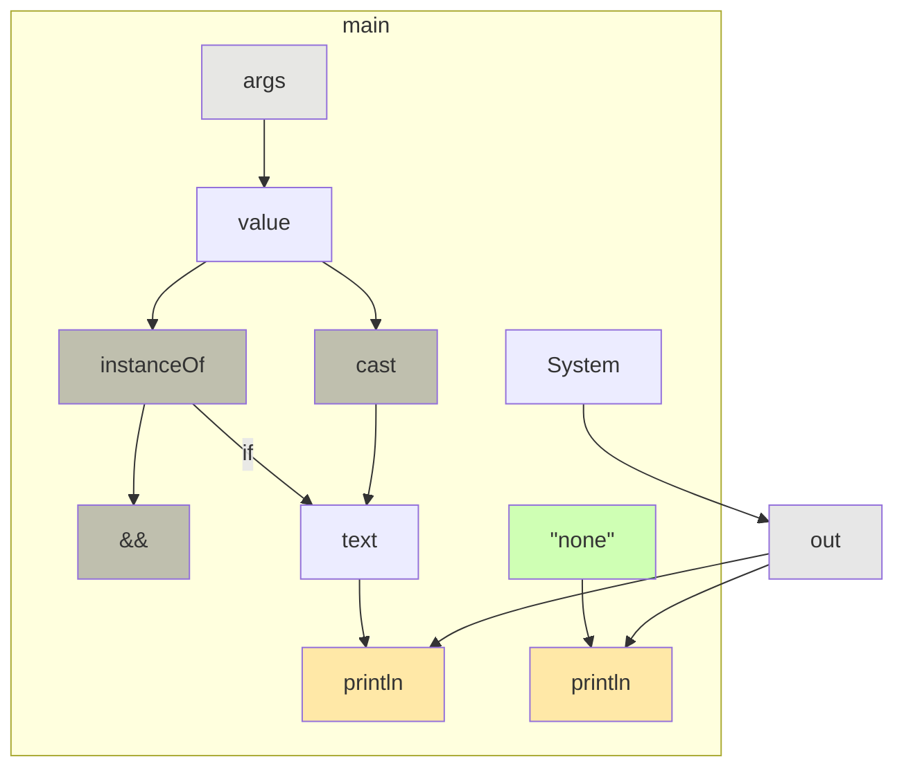

# unboundLocal: spike value graph (condensed)

```mermaid
flowchart TD
  subgraph m0["main"]
    n0["&&"]:::BIN_OP
    n1["cast"]:::BIN_OP
    n2["instanceOf"]:::BIN_OP
    n3["println"]:::EXTERNAL
    n4["println"]:::EXTERNAL
    n5["args"]:::FUNC_PARAM
    n6["#quot;none#quot;"]:::LITERAL
    n7["text"]:::OBJ_VARIABLE
    n8["value"]:::OBJ_VARIABLE
    n9["System"]:::OBJ_VARIABLE
  end
  n10["out"]:::VARIABLE
  n1 --> n7
  n10 --> n3
  n10 --> n4
  n2 --> n0
  n2 -->|if| n7
  n5 --> n8
  n6 --> n4
  n7 --> n3
  n8 --> n1
  n8 --> n2
  n9 --> n10
  classDef LITERAL fill:#00FF0030
  classDef VARIABLE fill:#80808030
  classDef BIN_OP fill:#80808080
  classDef FUNC_PARAM fill:#8080FF30
  classDef RETURN fill:#FF808080
  classDef EXTERNAL fill:#FFA50040
  classDef UNMODELLED fill:#FF000030,stroke-dasharray: 4 2
```
