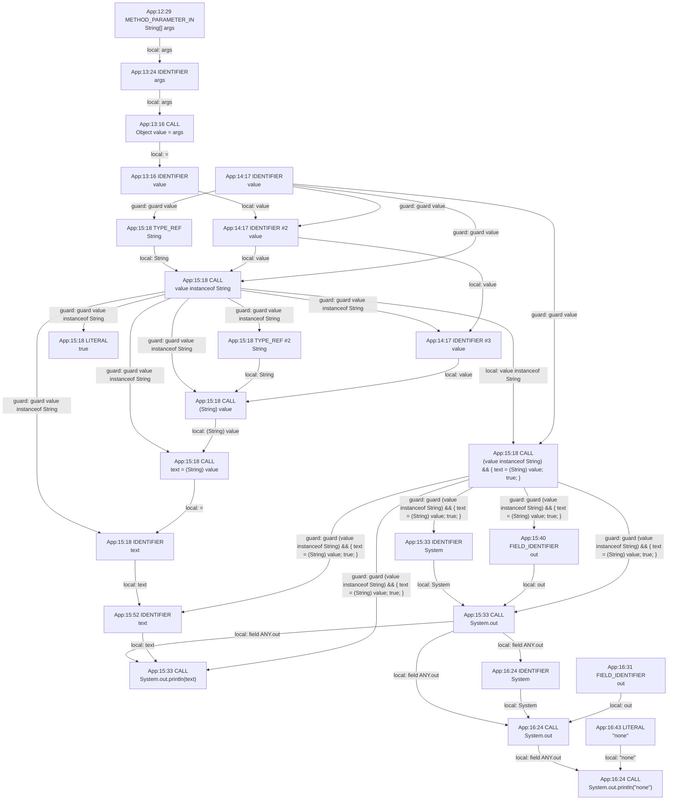

# unboundLocal: spike value graph

```mermaid
flowchart TD
  n0["App:12:29 METHOD_PARAMETER_IN<br/>String[] args"]
  n1["App:13:16 CALL<br/>Object value = args"]
  n2["App:13:16 IDENTIFIER<br/>value"]
  n3["App:13:24 IDENTIFIER<br/>args"]
  n4["App:14:17 IDENTIFIER #2<br/>value"]
  n5["App:14:17 IDENTIFIER #3<br/>value"]
  n6["App:14:17 IDENTIFIER<br/>value"]
  n7["App:15:18 CALL<br/>(String) value"]
  n8["App:15:18 CALL<br/>(value instanceof String) && { text = (String) value; true; }"]
  n9["App:15:18 CALL<br/>text = (String) value"]
  n10["App:15:18 CALL<br/>value instanceof String"]
  n11["App:15:18 IDENTIFIER<br/>text"]
  n12["App:15:18 LITERAL<br/>true"]
  n13["App:15:18 TYPE_REF #2<br/>String"]
  n14["App:15:18 TYPE_REF<br/>String"]
  n15["App:15:33 CALL<br/>System.out"]
  n16["App:15:33 CALL<br/>System.out.println(text)"]
  n17["App:15:33 IDENTIFIER<br/>System"]
  n18["App:15:40 FIELD_IDENTIFIER<br/>out"]
  n19["App:15:52 IDENTIFIER<br/>text"]
  n20["App:16:24 CALL<br/>System.out"]
  n21["App:16:24 CALL<br/>System.out.println(#quot;none#quot;)"]
  n22["App:16:24 IDENTIFIER<br/>System"]
  n23["App:16:31 FIELD_IDENTIFIER<br/>out"]
  n24["App:16:43 LITERAL<br/>#quot;none#quot;"]
  n0 -->|"local: args"| n3
  n1 -->|"local: ="| n2
  n10 -->|"guard: guard value instanceof String"| n11
  n10 -->|"guard: guard value instanceof String"| n12
  n10 -->|"guard: guard value instanceof String"| n13
  n10 -->|"guard: guard value instanceof String"| n5
  n10 -->|"guard: guard value instanceof String"| n7
  n10 -->|"guard: guard value instanceof String"| n9
  n10 -->|"local: value instanceof String"| n8
  n11 -->|"local: text"| n19
  n13 -->|"local: String"| n7
  n14 -->|"local: String"| n10
  n15 -->|"local: field ANY.out"| n16
  n15 -->|"local: field ANY.out"| n20
  n15 -->|"local: field ANY.out"| n22
  n17 -->|"local: System"| n15
  n18 -->|"local: out"| n15
  n19 -->|"local: text"| n16
  n2 -->|"local: value"| n4
  n20 -->|"local: field ANY.out"| n21
  n22 -->|"local: System"| n20
  n23 -->|"local: out"| n20
  n24 -->|"local: #quot;none#quot;"| n21
  n3 -->|"local: args"| n1
  n4 -->|"local: value"| n10
  n4 -->|"local: value"| n5
  n5 -->|"local: value"| n7
  n6 -->|"guard: guard value"| n10
  n6 -->|"guard: guard value"| n14
  n6 -->|"guard: guard value"| n4
  n6 -->|"guard: guard value"| n8
  n7 -->|"local: (String) value"| n9
  n8 -->|"guard: guard (value instanceof String) && { text = (String) value; true; }"| n15
  n8 -->|"guard: guard (value instanceof String) && { text = (String) value; true; }"| n16
  n8 -->|"guard: guard (value instanceof String) && { text = (String) value; true; }"| n17
  n8 -->|"guard: guard (value instanceof String) && { text = (String) value; true; }"| n18
  n8 -->|"guard: guard (value instanceof String) && { text = (String) value; true; }"| n19
  n9 -->|"local: ="| n11
```
