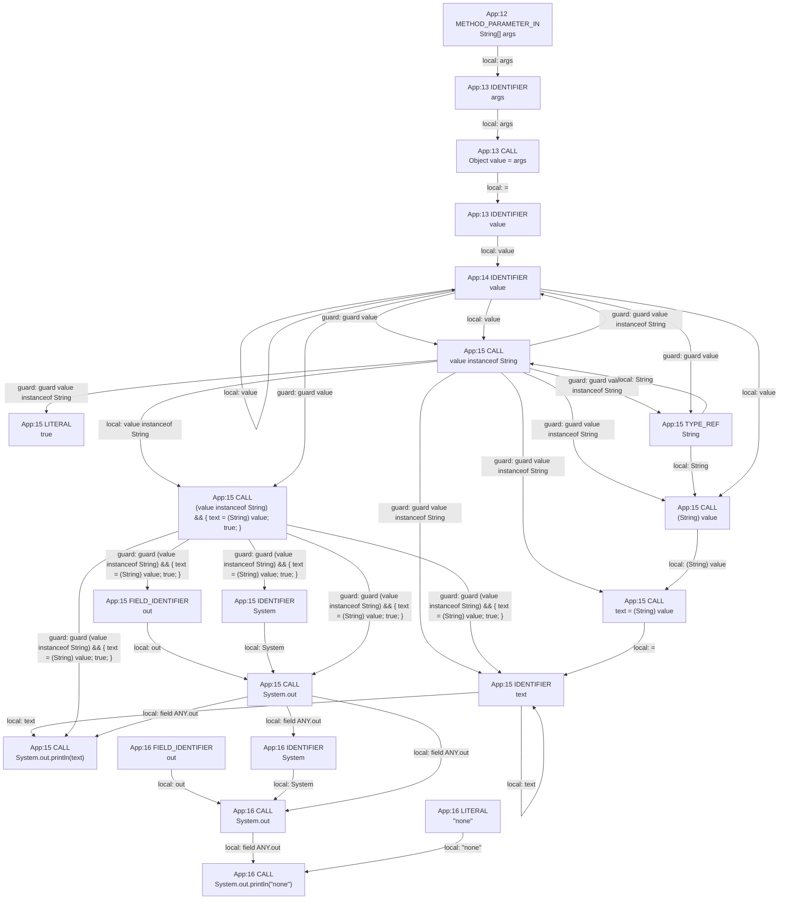

# unboundLocal: spike value graph

```mermaid
flowchart TD
  n0["App:12 METHOD_PARAMETER_IN<br/>String[] args"]
  n1["App:13 CALL<br/>Object value = args"]
  n2["App:13 IDENTIFIER<br/>args"]
  n3["App:13 IDENTIFIER<br/>value"]
  n4["App:14 IDENTIFIER<br/>value"]
  n5["App:15 CALL<br/>(String) value"]
  n6["App:15 CALL<br/>(value instanceof String) && { text = (String) value; true; }"]
  n7["App:15 CALL<br/>System.out"]
  n8["App:15 CALL<br/>System.out.println(text)"]
  n9["App:15 CALL<br/>text = (String) value"]
  n10["App:15 CALL<br/>value instanceof String"]
  n11["App:15 FIELD_IDENTIFIER<br/>out"]
  n12["App:15 IDENTIFIER<br/>System"]
  n13["App:15 IDENTIFIER<br/>text"]
  n14["App:15 LITERAL<br/>true"]
  n15["App:15 TYPE_REF<br/>String"]
  n16["App:16 CALL<br/>System.out"]
  n17["App:16 CALL<br/>System.out.println(#quot;none#quot;)"]
  n18["App:16 FIELD_IDENTIFIER<br/>out"]
  n19["App:16 IDENTIFIER<br/>System"]
  n20["App:16 LITERAL<br/>#quot;none#quot;"]
  n0 -->|"local: args"| n2
  n1 -->|"local: ="| n3
  n10 -->|"guard: guard value instanceof String"| n13
  n10 -->|"guard: guard value instanceof String"| n14
  n10 -->|"guard: guard value instanceof String"| n15
  n10 -->|"guard: guard value instanceof String"| n4
  n10 -->|"guard: guard value instanceof String"| n5
  n10 -->|"guard: guard value instanceof String"| n9
  n10 -->|"local: value instanceof String"| n6
  n11 -->|"local: out"| n7
  n12 -->|"local: System"| n7
  n13 -->|"local: text"| n13
  n13 -->|"local: text"| n8
  n15 -->|"local: String"| n10
  n15 -->|"local: String"| n5
  n16 -->|"local: field ANY.out"| n17
  n18 -->|"local: out"| n16
  n19 -->|"local: System"| n16
  n2 -->|"local: args"| n1
  n20 -->|"local: #quot;none#quot;"| n17
  n3 -->|"local: value"| n4
  n4 -->|"guard: guard value"| n10
  n4 -->|"guard: guard value"| n15
  n4 -->|"guard: guard value"| n4
  n4 -->|"guard: guard value"| n6
  n4 -->|"local: value"| n10
  n4 -->|"local: value"| n4
  n4 -->|"local: value"| n5
  n5 -->|"local: (String) value"| n9
  n6 -->|"guard: guard (value instanceof String) && { text = (String) value; true; }"| n11
  n6 -->|"guard: guard (value instanceof String) && { text = (String) value; true; }"| n12
  n6 -->|"guard: guard (value instanceof String) && { text = (String) value; true; }"| n13
  n6 -->|"guard: guard (value instanceof String) && { text = (String) value; true; }"| n7
  n6 -->|"guard: guard (value instanceof String) && { text = (String) value; true; }"| n8
  n7 -->|"local: field ANY.out"| n16
  n7 -->|"local: field ANY.out"| n19
  n7 -->|"local: field ANY.out"| n8
  n9 -->|"local: ="| n13
```
