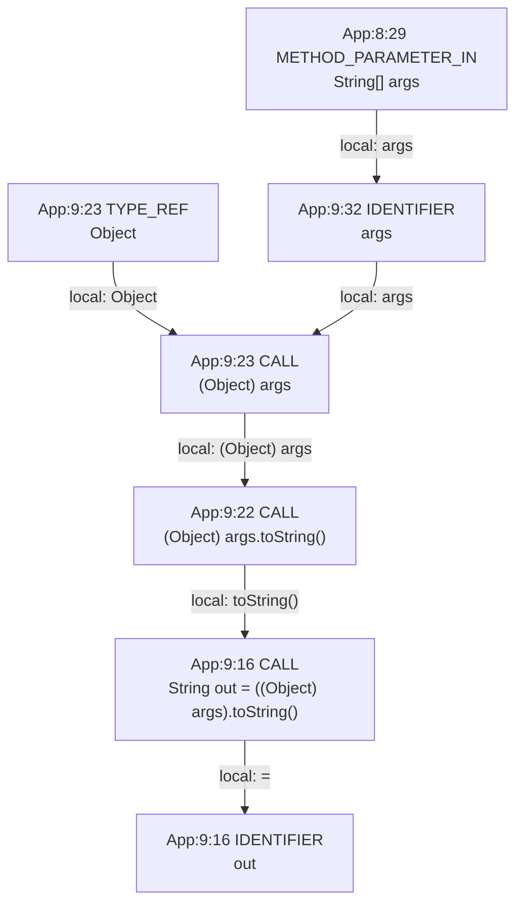

# unmodelledReceiver: spike value graph

```mermaid
flowchart TD
  n0["App:8:29 METHOD_PARAMETER_IN<br/>String[] args"]
  n1["App:9:16 CALL<br/>String out = ((Object) args).toString()"]
  n2["App:9:16 IDENTIFIER<br/>out"]
  n3["App:9:22 CALL<br/>(Object) args.toString()"]
  n4["App:9:23 CALL<br/>(Object) args"]
  n5["App:9:23 TYPE_REF<br/>Object"]
  n6["App:9:32 IDENTIFIER<br/>args"]
  n0 -->|"local: args"| n6
  n1 -->|"local: ="| n2
  n3 -->|"local: toString()"| n1
  n4 -->|"local: (Object) args"| n3
  n5 -->|"local: Object"| n4
  n6 -->|"local: args"| n4
```
