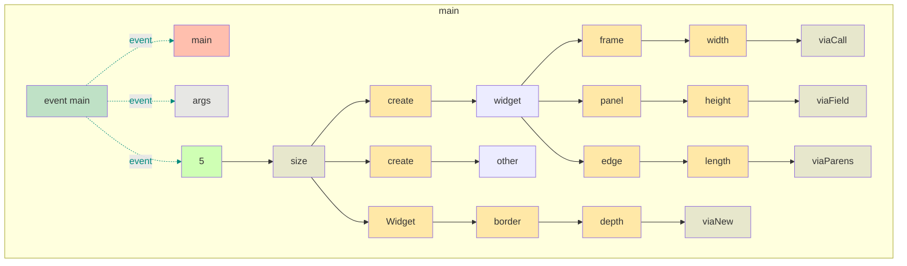

```mermaid
flowchart TD
  subgraph b0["main"]
    n1[event main]:::EVENT
    n2[main]:::RETURN
    n3[args]:::FUNC_PARAM
    n4[5]:::LITERAL
    n5[size]:::VARIABLE
    n6[create]:::EXTERNAL
    n7[widget]:::OBJ_VARIABLE
    n8[create]:::EXTERNAL
    n9[other]:::OBJ_VARIABLE
    n10[frame]:::EXTERNAL
    n11[width]:::EXTERNAL
    n12[viaCall]:::VARIABLE
    n13[panel]:::EXTERNAL
    n14[height]:::EXTERNAL
    n15[viaField]:::VARIABLE
    n16[Widget]:::EXTERNAL
    n17[border]:::EXTERNAL
    n18[depth]:::EXTERNAL
    n19[viaNew]:::VARIABLE
    n20[edge]:::EXTERNAL
    n21[length]:::EXTERNAL
    n22[viaParens]:::VARIABLE
    n1[event main]:::EVENT -. event .-> n2[main]:::RETURN
    n1[event main]:::EVENT -. event .-> n3[args]:::FUNC_PARAM
    n1[event main]:::EVENT -. event .-> n4[5]:::LITERAL
    n4[5]:::LITERAL --> n5[size]:::VARIABLE
    n5[size]:::VARIABLE --> n6[create]:::EXTERNAL
    n5[size]:::VARIABLE --> n8[create]:::EXTERNAL
    n5[size]:::VARIABLE --> n16[Widget]:::EXTERNAL
    n6[create]:::EXTERNAL --> n7[widget]:::OBJ_VARIABLE
    n7[widget]:::OBJ_VARIABLE --> n10[frame]:::EXTERNAL
    n7[widget]:::OBJ_VARIABLE --> n13[panel]:::EXTERNAL
    n7[widget]:::OBJ_VARIABLE --> n20[edge]:::EXTERNAL
    n8[create]:::EXTERNAL --> n9[other]:::OBJ_VARIABLE
    n10[frame]:::EXTERNAL --> n11[width]:::EXTERNAL
    n11[width]:::EXTERNAL --> n12[viaCall]:::VARIABLE
    n13[panel]:::EXTERNAL --> n14[height]:::EXTERNAL
    n14[height]:::EXTERNAL --> n15[viaField]:::VARIABLE
    n16[Widget]:::EXTERNAL --> n17[border]:::EXTERNAL
    n17[border]:::EXTERNAL --> n18[depth]:::EXTERNAL
    n18[depth]:::EXTERNAL --> n19[viaNew]:::VARIABLE
    n20[edge]:::EXTERNAL --> n21[length]:::EXTERNAL
    n21[length]:::EXTERNAL --> n22[viaParens]:::VARIABLE
  end
  linkStyle 0 stroke:#00897b,color:#00897b
  linkStyle 1 stroke:#00897b,color:#00897b
  linkStyle 2 stroke:#00897b,color:#00897b
  classDef LITERAL fill:#00FF0030
  classDef VARIABLE fill:#80808030
  classDef BIN_OP fill:#80808080
  classDef FUNC_PARAM fill:#8080FF30
  classDef RETURN fill:#FF808080
  classDef EXTERNAL fill:#FFA50040
  classDef UNMODELLED fill:#FF000030,stroke-dasharray: 4 2
  classDef EVENT fill:#00897B40
```
