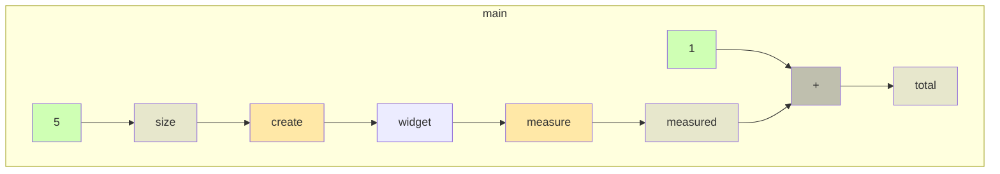

# unresolvedType: spike value graph (condensed)

```mermaid
flowchart TD
  subgraph m0["main"]
    n0["+"]:::BIN_OP
    n1["create"]:::EXTERNAL
    n2["measure"]:::EXTERNAL
    n3["1"]:::LITERAL
    n4["5"]:::LITERAL
    n5["widget"]:::OBJ_VARIABLE
    n6["measured"]:::VARIABLE
    n7["size"]:::VARIABLE
    n8["total"]:::VARIABLE
  end
  n0 --> n8
  n1 --> n5
  n2 --> n6
  n3 --> n0
  n4 --> n7
  n5 --> n2
  n6 --> n0
  n7 --> n1
  classDef LITERAL fill:#00FF0030
  classDef VARIABLE fill:#80808030
  classDef BIN_OP fill:#80808080
  classDef FUNC_PARAM fill:#8080FF30
  classDef RETURN fill:#FF808080
  classDef EXTERNAL fill:#FFA50040
  classDef UNMODELLED fill:#FF000030,stroke-dasharray: 4 2
```
