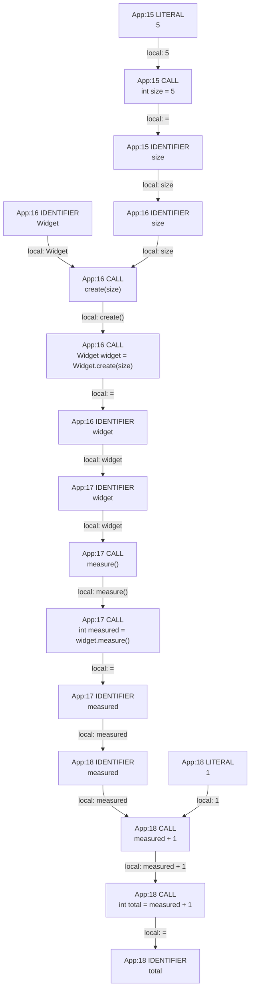

# unresolvedType: spike value graph

```mermaid
flowchart TD
  n0["App:15 CALL<br/>int size = 5"]
  n1["App:15 IDENTIFIER<br/>size"]
  n2["App:15 LITERAL<br/>5"]
  n3["App:16 CALL<br/>Widget widget = Widget.create(size)"]
  n4["App:16 CALL<br/>create(size)"]
  n5["App:16 IDENTIFIER<br/>Widget"]
  n6["App:16 IDENTIFIER<br/>size"]
  n7["App:16 IDENTIFIER<br/>widget"]
  n8["App:17 CALL<br/>int measured = widget.measure()"]
  n9["App:17 CALL<br/>measure()"]
  n10["App:17 IDENTIFIER<br/>measured"]
  n11["App:17 IDENTIFIER<br/>widget"]
  n12["App:18 CALL<br/>int total = measured + 1"]
  n13["App:18 CALL<br/>measured + 1"]
  n14["App:18 IDENTIFIER<br/>measured"]
  n15["App:18 IDENTIFIER<br/>total"]
  n16["App:18 LITERAL<br/>1"]
  n0 -->|"local: ="| n1
  n1 -->|"local: size"| n6
  n10 -->|"local: measured"| n14
  n11 -->|"local: widget"| n9
  n12 -->|"local: ="| n15
  n13 -->|"local: measured + 1"| n12
  n14 -->|"local: measured"| n13
  n16 -->|"local: 1"| n13
  n2 -->|"local: 5"| n0
  n3 -->|"local: ="| n7
  n4 -->|"local: create()"| n3
  n5 -->|"local: Widget"| n4
  n6 -->|"local: size"| n4
  n7 -->|"local: widget"| n11
  n8 -->|"local: ="| n10
  n9 -->|"local: measure()"| n8
```
