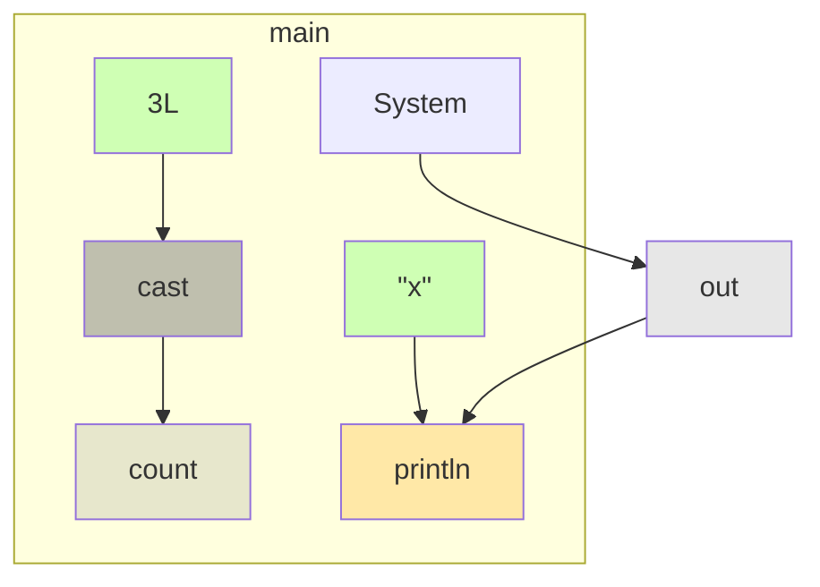

# unsupported: spike value graph (condensed)

```mermaid
flowchart TD
  subgraph m0["main"]
    n0["cast"]:::BIN_OP
    n1["println"]:::EXTERNAL
    n2["#quot;x#quot;"]:::LITERAL
    n3["3L"]:::LITERAL
    n4["System"]:::OBJ_VARIABLE
    n5["count"]:::VARIABLE
  end
  n6["out"]:::VARIABLE
  n0 --> n5
  n2 --> n1
  n3 --> n0
  n4 --> n6
  n6 --> n1
  classDef LITERAL fill:#00FF0030
  classDef VARIABLE fill:#80808030
  classDef BIN_OP fill:#80808080
  classDef FUNC_PARAM fill:#8080FF30
  classDef RETURN fill:#FF808080
  classDef EXTERNAL fill:#FFA50040
  classDef UNMODELLED fill:#FF000030,stroke-dasharray: 4 2
```
