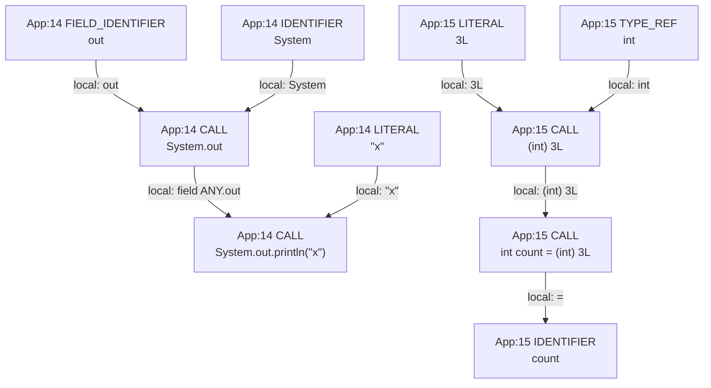

# unsupported: spike value graph

```mermaid
flowchart TD
  n0["App:14 CALL<br/>System.out"]
  n1["App:14 CALL<br/>System.out.println(#quot;x#quot;)"]
  n2["App:14 FIELD_IDENTIFIER<br/>out"]
  n3["App:14 IDENTIFIER<br/>System"]
  n4["App:14 LITERAL<br/>#quot;x#quot;"]
  n5["App:15 CALL<br/>(int) 3L"]
  n6["App:15 CALL<br/>int count = (int) 3L"]
  n7["App:15 IDENTIFIER<br/>count"]
  n8["App:15 LITERAL<br/>3L"]
  n9["App:15 TYPE_REF<br/>int"]
  n0 -->|"local: field ANY.out"| n1
  n2 -->|"local: out"| n0
  n3 -->|"local: System"| n0
  n4 -->|"local: #quot;x#quot;"| n1
  n5 -->|"local: (int) 3L"| n6
  n6 -->|"local: ="| n7
  n8 -->|"local: 3L"| n5
  n9 -->|"local: int"| n5
```
