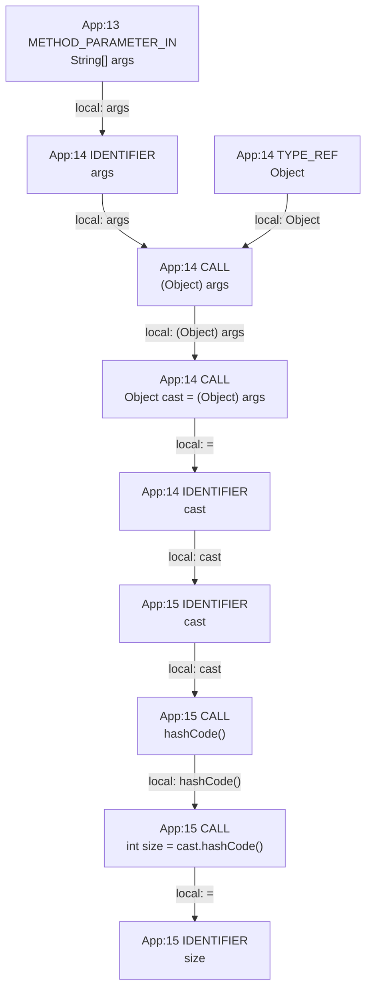

# unsupportedAssignment: spike value graph

```mermaid
flowchart TD
  n0["App:13 METHOD_PARAMETER_IN<br/>String[] args"]
  n1["App:14 CALL<br/>(Object) args"]
  n2["App:14 CALL<br/>Object cast = (Object) args"]
  n3["App:14 IDENTIFIER<br/>args"]
  n4["App:14 IDENTIFIER<br/>cast"]
  n5["App:14 TYPE_REF<br/>Object"]
  n6["App:15 CALL<br/>hashCode()"]
  n7["App:15 CALL<br/>int size = cast.hashCode()"]
  n8["App:15 IDENTIFIER<br/>cast"]
  n9["App:15 IDENTIFIER<br/>size"]
  n0 -->|"local: args"| n3
  n1 -->|"local: (Object) args"| n2
  n2 -->|"local: ="| n4
  n3 -->|"local: args"| n1
  n4 -->|"local: cast"| n8
  n5 -->|"local: Object"| n1
  n6 -->|"local: hashCode()"| n7
  n7 -->|"local: ="| n9
  n8 -->|"local: cast"| n6
```
