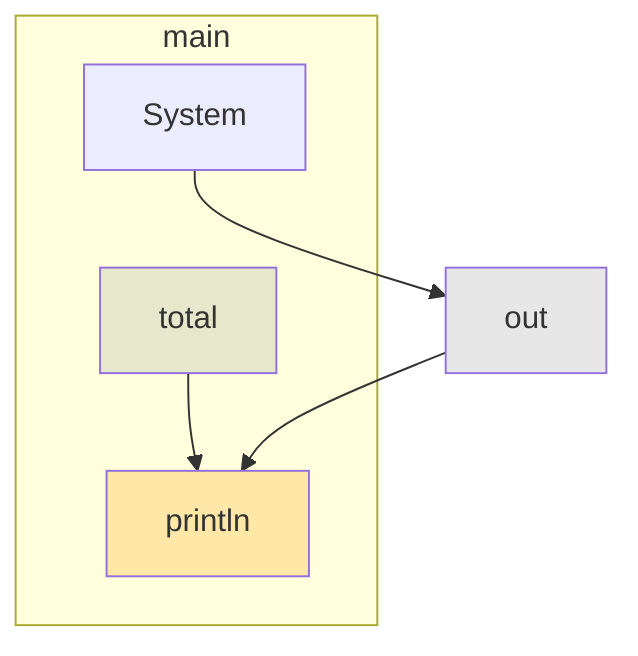

# unwrittenLocal: spike value graph (condensed)

```mermaid
flowchart TD
  subgraph m0["main"]
    n0["println"]:::EXTERNAL
    n1["System"]:::OBJ_VARIABLE
    n2["total"]:::VARIABLE
  end
  n3["out"]:::VARIABLE
  n1 --> n3
  n2 --> n0
  n3 --> n0
  classDef LITERAL fill:#00FF0030
  classDef VARIABLE fill:#80808030
  classDef BIN_OP fill:#80808080
  classDef FUNC_PARAM fill:#8080FF30
  classDef RETURN fill:#FF808080
  classDef EXTERNAL fill:#FFA50040
  classDef UNMODELLED fill:#FF000030,stroke-dasharray: 4 2
```
