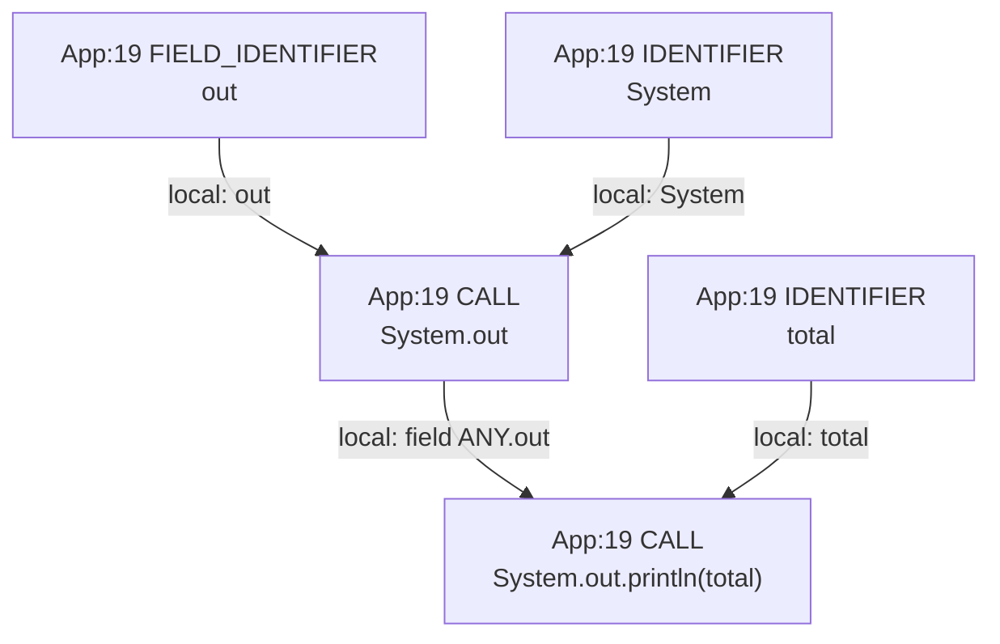

# unwrittenLocal: spike value graph

```mermaid
flowchart TD
  n0["App:19 CALL<br/>System.out"]
  n1["App:19 CALL<br/>System.out.println(total)"]
  n2["App:19 FIELD_IDENTIFIER<br/>out"]
  n3["App:19 IDENTIFIER<br/>System"]
  n4["App:19 IDENTIFIER<br/>total"]
  n0 -->|"local: field ANY.out"| n1
  n2 -->|"local: out"| n0
  n3 -->|"local: System"| n0
  n4 -->|"local: total"| n1
```
