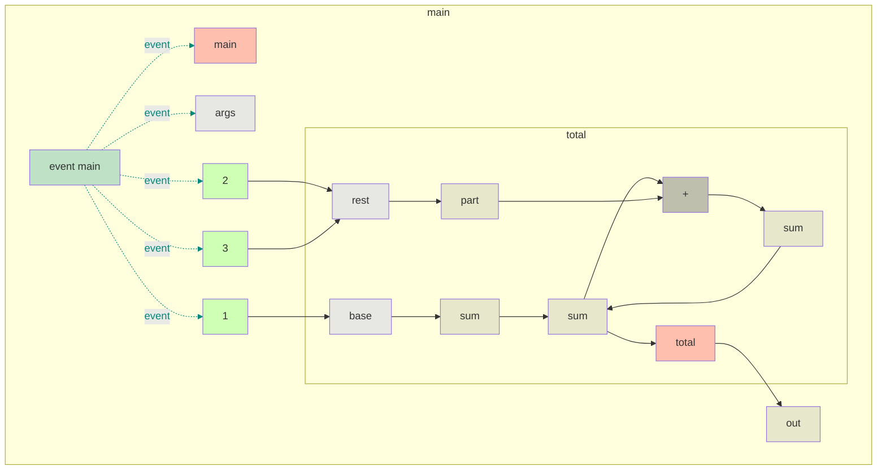

```mermaid
flowchart TD
  subgraph b0["main"]
    n1[event main]:::EVENT
    n2[main]:::RETURN
    n3[args]:::FUNC_PARAM
    n4[1]:::LITERAL
    n5[2]:::LITERAL
    n6[3]:::LITERAL
    n16[out]:::VARIABLE
    n1[event main]:::EVENT -. event .-> n2[main]:::RETURN
    n1[event main]:::EVENT -. event .-> n3[args]:::FUNC_PARAM
    n1[event main]:::EVENT -. event .-> n4[1]:::LITERAL
    n1[event main]:::EVENT -. event .-> n5[2]:::LITERAL
    n1[event main]:::EVENT -. event .-> n6[3]:::LITERAL
    n4[1]:::LITERAL --> n9[base]:::FUNC_PARAM
    n5[2]:::LITERAL --> n10[rest]:::FUNC_PARAM
    n6[3]:::LITERAL --> n10[rest]:::FUNC_PARAM
    n8[total]:::RETURN --> n16[out]:::VARIABLE
    subgraph b7["total"]
      n8[total]:::RETURN
      n9[base]:::FUNC_PARAM
      n10[rest]:::FUNC_PARAM
      n11[sum]:::VARIABLE
      n12[sum]:::VARIABLE
      n13[part]:::VARIABLE
      n14[+]:::BIN_OP
      n15[sum]:::VARIABLE
      n9[base]:::FUNC_PARAM --> n11[sum]:::VARIABLE
      n10[rest]:::FUNC_PARAM --> n13[part]:::VARIABLE
      n11[sum]:::VARIABLE --> n12[sum]:::VARIABLE
      n12[sum]:::VARIABLE --> n14[+]:::BIN_OP
      n12[sum]:::VARIABLE --> n8[total]:::RETURN
      n13[part]:::VARIABLE --> n14[+]:::BIN_OP
      n14[+]:::BIN_OP --> n15[sum]:::VARIABLE
      n15[sum]:::VARIABLE --> n12[sum]:::VARIABLE
    end
  end
  linkStyle 0 stroke:#00897b,color:#00897b
  linkStyle 1 stroke:#00897b,color:#00897b
  linkStyle 2 stroke:#00897b,color:#00897b
  linkStyle 3 stroke:#00897b,color:#00897b
  linkStyle 4 stroke:#00897b,color:#00897b
  classDef LITERAL fill:#00FF0030
  classDef VARIABLE fill:#80808030
  classDef BIN_OP fill:#80808080
  classDef FUNC_PARAM fill:#8080FF30
  classDef RETURN fill:#FF808080
  classDef EXTERNAL fill:#FFA50040
  classDef UNMODELLED fill:#FF000030,stroke-dasharray: 4 2
  classDef EVENT fill:#00897B40
```
