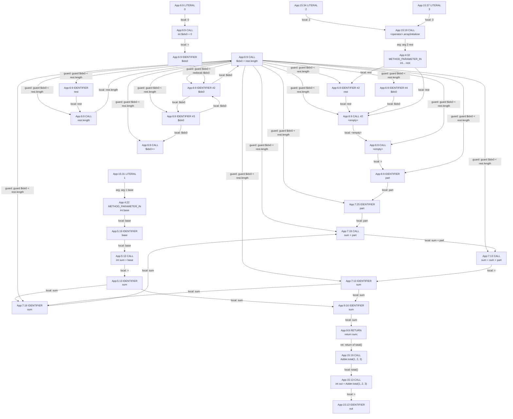

# varargs: spike value graph

```mermaid
flowchart TD
  n0["App:15:13 CALL<br/>int out = Adder.total(1, 2, 3)"]
  n1["App:15:13 IDENTIFIER<br/>out"]
  n2["App:15:19 CALL<br/>#lt;operator#gt;.arrayInitializer"]
  n3["App:15:19 CALL<br/>Adder.total(1, 2, 3)"]
  n4["App:15:31 LITERAL<br/>1"]
  n5["App:15:34 LITERAL<br/>2"]
  n6["App:15:37 LITERAL<br/>3"]
  n7["App:4:22 METHOD_PARAMETER_IN<br/>int base"]
  n8["App:4:32 METHOD_PARAMETER_IN<br/>int... rest"]
  n9["App:5:13 CALL<br/>int sum = base"]
  n10["App:5:13 IDENTIFIER<br/>sum"]
  n11["App:5:19 IDENTIFIER<br/>base"]
  n12["App:6:9 CALL #2<br/>#lt;empty#gt;"]
  n13["App:6:9 CALL<br/>#lt;empty#gt;"]
  n14["App:6:9 CALL<br/>$idx0 #lt; rest.length"]
  n15["App:6:9 CALL<br/>$idx0++"]
  n16["App:6:9 CALL<br/>int $idx0 = 0"]
  n17["App:6:9 CALL<br/>rest.length"]
  n18["App:6:9 IDENTIFIER #2<br/>$idx0"]
  n19["App:6:9 IDENTIFIER #2<br/>rest"]
  n20["App:6:9 IDENTIFIER #3<br/>$idx0"]
  n21["App:6:9 IDENTIFIER #4<br/>$idx0"]
  n22["App:6:9 IDENTIFIER<br/>$idx0"]
  n23["App:6:9 IDENTIFIER<br/>part"]
  n24["App:6:9 IDENTIFIER<br/>rest"]
  n25["App:6:9 LITERAL<br/>0"]
  n26["App:7:13 CALL<br/>sum = sum + part"]
  n27["App:7:13 IDENTIFIER<br/>sum"]
  n28["App:7:19 CALL<br/>sum + part"]
  n29["App:7:19 IDENTIFIER<br/>sum"]
  n30["App:7:25 IDENTIFIER<br/>part"]
  n31["App:9:16 IDENTIFIER<br/>sum"]
  n32["App:9:9 RETURN<br/>return sum;"]
  n0 -->|"local: ="| n1
  n10 -->|"local: sum"| n29
  n10 -->|"local: sum"| n31
  n11 -->|"local: base"| n9
  n12 -->|"local: #lt;empty#gt;"| n13
  n13 -->|"local: ="| n23
  n14 -->|"guard: guard $idx0 #lt; rest.length"| n12
  n14 -->|"guard: guard $idx0 #lt; rest.length"| n13
  n14 -->|"guard: guard $idx0 #lt; rest.length"| n15
  n14 -->|"guard: guard $idx0 #lt; rest.length"| n17
  n14 -->|"guard: guard $idx0 #lt; rest.length"| n18
  n14 -->|"guard: guard $idx0 #lt; rest.length"| n19
  n14 -->|"guard: guard $idx0 #lt; rest.length"| n20
  n14 -->|"guard: guard $idx0 #lt; rest.length"| n21
  n14 -->|"guard: guard $idx0 #lt; rest.length"| n23
  n14 -->|"guard: guard $idx0 #lt; rest.length"| n24
  n14 -->|"guard: guard $idx0 #lt; rest.length"| n26
  n14 -->|"guard: guard $idx0 #lt; rest.length"| n27
  n14 -->|"guard: guard $idx0 #lt; rest.length"| n28
  n14 -->|"guard: guard $idx0 #lt; rest.length"| n29
  n14 -->|"guard: guard $idx0 #lt; rest.length"| n30
  n16 -->|"local: ="| n22
  n17 -->|"local: rest.length"| n14
  n18 -->|"local: $idx0"| n14
  n18 -->|"local: $idx0"| n20
  n19 -->|"local: rest"| n12
  n2 -->|"arg: arg 2 rest"| n8
  n20 -->|"local: $idx0"| n15
  n20 -->|"local: $idx0"| n18
  n21 -->|"local: $idx0"| n12
  n22 -->|"local: $idx0"| n18
  n23 -->|"local: part"| n30
  n24 -->|"local: rest"| n17
  n25 -->|"local: 0"| n16
  n26 -->|"local: ="| n27
  n27 -->|"local: sum"| n29
  n27 -->|"local: sum"| n31
  n28 -->|"local: sum + part"| n26
  n29 -->|"local: sum"| n28
  n3 -->|"local: total()"| n0
  n30 -->|"local: part"| n28
  n31 -->|"local: sum"| n32
  n32 -->|"ret: return of total()"| n3
  n4 -->|"arg: arg 1 base"| n7
  n5 -->|"local: 2"| n2
  n6 -->|"local: 3"| n2
  n7 -->|"local: base"| n11
  n8 -->|"local: rest"| n12
  n8 -->|"local: rest"| n19
  n9 -->|"local: ="| n10
```
