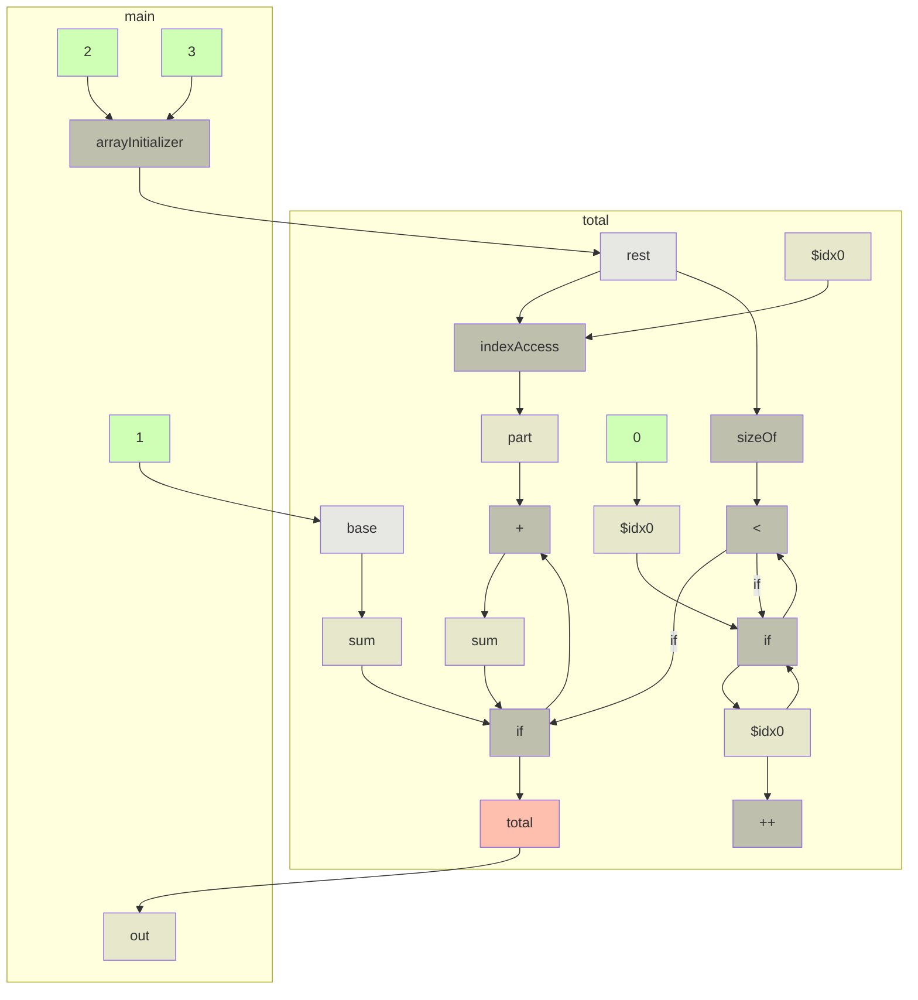

# varargs: spike value graph (condensed)

```mermaid
flowchart TD
  subgraph m0["total"]
    n0["++"]:::BIN_OP
    n1["+"]:::BIN_OP
    n2["#lt;"]:::BIN_OP
    n3["indexAccess"]:::BIN_OP
    n4["sizeOf"]:::BIN_OP
    n5["base"]:::FUNC_PARAM
    n6["rest"]:::FUNC_PARAM
    n7["if"]:::BIN_OP
    n8["if"]:::BIN_OP
    n9["0"]:::LITERAL
    n10["total"]:::RETURN
    n11["$idx0"]:::VARIABLE
    n12["$idx0"]:::VARIABLE
    n13["$idx0"]:::VARIABLE
    n14["part"]:::VARIABLE
    n15["sum"]:::VARIABLE
    n16["sum"]:::VARIABLE
  end
  subgraph m1["main"]
    n17["arrayInitializer"]:::BIN_OP
    n18["1"]:::LITERAL
    n19["2"]:::LITERAL
    n20["3"]:::LITERAL
    n21["out"]:::VARIABLE
  end
  n1 --> n16
  n10 --> n21
  n11 --> n3
  n12 --> n8
  n13 --> n0
  n13 --> n8
  n14 --> n1
  n15 --> n7
  n16 --> n7
  n17 --> n6
  n18 --> n5
  n19 --> n17
  n2 -->|if| n7
  n2 -->|if| n8
  n20 --> n17
  n3 --> n14
  n4 --> n2
  n5 --> n15
  n6 --> n3
  n6 --> n4
  n7 --> n1
  n7 --> n10
  n8 --> n13
  n8 --> n2
  n9 --> n12
  classDef LITERAL fill:#00FF0030
  classDef VARIABLE fill:#80808030
  classDef BIN_OP fill:#80808080
  classDef FUNC_PARAM fill:#8080FF30
  classDef RETURN fill:#FF808080
  classDef EXTERNAL fill:#FFA50040
  classDef UNMODELLED fill:#FF000030,stroke-dasharray: 4 2
```
